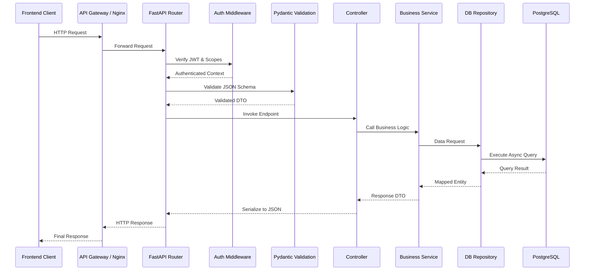
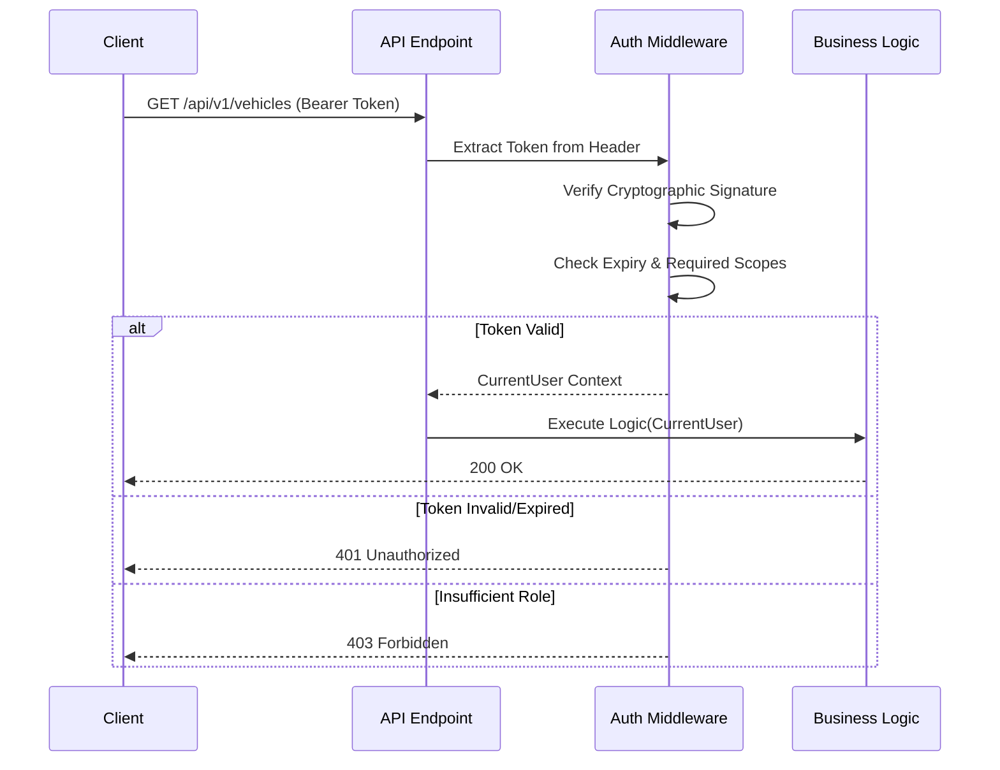
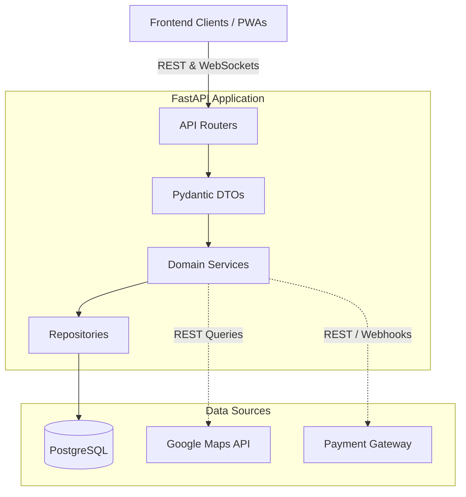

# API Design

## Overview
The Raahi backend exposes a comprehensive set of RESTful APIs designed to power the Employee PWA, the Administration Portal, and third-party webhooks (e.g., payment gateways and WhatsApp interactions).

- **API Architecture**: The system utilizes a standard RESTful architecture over HTTPS for all CRUD and business operations, supplemented by WebSockets specifically for real-time journey chat.
- **REST Principles Followed**: Resources are strictly represented by nouns (e.g., `/vehicles`, `/rides`). HTTP methods strictly dictate actions (`GET` for reading, `POST` for creation and complex searches, `PUT`/`PATCH` for updates, `DELETE` for removals).
- **Naming Conventions**: `snake_case` is utilized for JSON payloads and database fields; `kebab-case` is utilized for URL paths.
- **Versioning Strategy**: URI path versioning (e.g., `/api/v1/...`) is implemented universally to ensure backward compatibility as the platform evolves.
- **Authentication Approach**: Stateless JSON Web Tokens (JWT) passed via the `Authorization: Bearer <token>` header.
- **Error Handling Strategy**: Standardized JSON responses for all errors, utilizing appropriate HTTP status codes (e.g., `400` for business logic violations, `422` for schema validation, `401`/`403` for auth).

---

# API Architecture



---

# API Standards

- **Base URL**: `https://api.raahi.com` (Production) / `http://localhost:8000` (Local Development)
- **API Version**: `v1`
- **HTTP Methods**:
  - `GET`: Retrieve resources.
  - `POST`: Create new resources or execute complex criteria-based searches.
  - `PUT`: Fully update a resource.
  - `PATCH`: Partially update a resource.
  - `DELETE`: Remove or soft-delete a resource.
- **Status Codes**: 
  - `200 OK`, `201 Created`
  - `400 Bad Request`, `401 Unauthorized`, `403 Forbidden`, `404 Not Found`
  - `422 Unprocessable Entity`
  - `500 Internal Server Error`
- **Naming Convention**: Paths use `kebab-case` (e.g., `/api/v1/ride-requests`). JSON payloads use `snake_case`.
- **Pagination Strategy**: Standard `limit` and `offset` implemented via query parameters (e.g., `?limit=20&offset=0`).
- **Filtering**: Executed via specific query parameters (e.g., `?status=completed&date=2023-10-01`).
- **Validation**: Enforced heavily at the boundary by Pydantic v2 models.
- **Error Response Format**:
  ```json
  {
    "detail": "Human readable error description explaining why the request failed",
    "error_code": "SPECIFIC_BUSINESS_ERROR_CODE"
  }
  ```

---

# Authentication APIs

### Administrator Login
- **Endpoint**: `/api/v1/admin/auth/login`
- **Method**: `POST`
- **Purpose**: Authenticates platform administrators.
- **Authentication Required**: No.
- **Request Parameters**: None.
- **Request Body**: 
  ```json
  {
    "email": "admin@company.com", 
    "password": "secure_password"
  }
  ```
- **Success Response**: `200 OK` - `{"access_token": "eyJhbG...", "token_type": "bearer"}`
- **Possible Errors**: `401 Unauthorized` (Invalid credentials), `422 Unprocessable Entity` (Schema validation failed).
- **Business Logic**: Retrieves user record, verifies bcrypt hash, and signs a JWT containing role scopes.
- **Database Tables Used**: `users`

*(Note: Employee authentication is handled via internal SSO or OTP flows explicitly managed via the `employee_self_service_router`, functioning identically in returning a standard JWT).*

---

# User APIs

### Get Employee Profile
- **Endpoint**: `/api/v1/employees/me`
- **Method**: `GET`
- **Purpose**: Retrieves the authenticated user's profile and organizational mapping.
- **Authentication Required**: Yes (Bearer Token).
- **Success Response**: `200 OK` - `{"id": "uuid", "email": "user@corp.com", "first_name": "Jane", "last_name": "Doe"}`
- **Possible Errors**: `401 Unauthorized`
- **Business Logic**: Extracts user ID directly from the validated JWT to fetch the specific profile securely.

### Update Employee Profile
- **Endpoint**: `/api/v1/employees/me`
- **Method**: `PUT`
- **Purpose**: Updates personal employee information.
- **Authentication Required**: Yes.
- **Request Body**: `{"first_name": "Jane", "last_name": "Doe"}`
- **Success Response**: `200 OK`

---

# Organization APIs

### Get Organization Details
- **Endpoint**: `/api/v1/organizations/{org_id}`
- **Method**: `GET`
- **Purpose**: Retrieves corporate details and limits.
- **Authentication Required**: Yes (Admin Scope).
- **Database Tables Used**: `organizations`

### Update Organization Settings
- **Endpoint**: `/api/v1/organizations/{org_id}/settings`
- **Method**: `PUT`
- **Purpose**: Updates organizational configurations, allowed email domains, and billing metrics.
- **Authentication Required**: Yes (Admin Scope).

---

# Vehicle APIs

### Register Vehicle
- **Endpoint**: `/api/v1/vehicles`
- **Method**: `POST`
- **Purpose**: Registers a new vehicle for the authenticated employee to use in future carpools.
- **Authentication Required**: Yes.
- **Request Body**: 
  ```json
  {
    "make": "Honda", 
    "model": "Civic", 
    "license_plate": "XYZ-1234", 
    "capacity": 3
  }
  ```
- **Success Response**: `201 Created`
- **Database Tables Used**: `vehicles`

### Get My Vehicles
- **Endpoint**: `/api/v1/vehicles`
- **Method**: `GET`
- **Purpose**: Retrieves all vehicles currently owned and registered by the caller.

---

# Ride APIs

### Publish Ride (Ride Discovery)
- **Endpoint**: `/api/v1/rides`
- **Method**: `POST`
- **Purpose**: Allows a driver to publish a new carpool journey.
- **Authentication Required**: Yes.
- **Request Body**: 
  ```json
  {
    "vehicle_id": "uuid", 
    "start_location": "Address String", 
    "end_location": "Address String", 
    "start_time": "2023-10-15T08:00:00Z"
  }
  ```
- **Success Response**: `201 Created`
- **Business Logic**: Validates that the driver actually owns the requested vehicle and prevents scheduling temporal conflicts for the same driver.
- **Database Tables Used**: `rides`, `vehicles`

### Search Available Rides
- **Endpoint**: `/api/v1/rides/search`
- **Method**: `POST`
- **Purpose**: Finds rides matching passenger criteria, leveraging Google Maps matching logic internally to determine viable detours.

---

# Booking APIs

### Book Ride
- **Endpoint**: `/api/v1/rides/{ride_id}/requests`
- **Method**: `POST`
- **Purpose**: Submits a request to join a published ride.
- **Authentication Required**: Yes.
- **Business Logic**: Validates remaining seat availability, prevents a driver from booking their own ride, prevents duplicate bookings by the same user, and checks passenger wallet balance implicitly.
- **Database Tables Used**: `ride_requests`, `rides`

### Approve Booking (Driver Action)
- **Endpoint**: `/api/v1/rides/requests/{request_id}/approve`
- **Method**: `POST`
- **Purpose**: Driver accepts a passenger's request, decreasing the `seats_available` counter.

---

# Trip APIs

### Start Trip
- **Endpoint**: `/api/v1/trips/{ride_id}/start`
- **Method**: `POST`
- **Purpose**: Transitions ride status from `scheduled` to `active`.
- **Authentication Required**: Yes (Caller must be the driver of the ride).

### Complete Trip
- **Endpoint**: `/api/v1/trips/{ride_id}/complete`
- **Method**: `POST`
- **Purpose**: Marks the trip as finished and triggers background asynchronous payment settlements (moving funds from passenger wallets to the driver wallet).

---

# Wallet APIs

### Get Wallet Balance
- **Endpoint**: `/api/v1/wallet`
- **Method**: `GET`
- **Purpose**: Retrieves current user's digital wallet balance.
- **Authentication Required**: Yes.

### Get Transaction History
- **Endpoint**: `/api/v1/wallet/transactions`
- **Method**: `GET`
- **Purpose**: Retrieves paginated ledger history for the caller.

---

# Payment APIs

### Initialize Top-Up
- **Endpoint**: `/api/v1/payments/top-up`
- **Method**: `POST`
- **Purpose**: Initializes a payment intent with the external gateway to add funds to the wallet.
- **Authentication Required**: Yes.

### Payment Webhook (Callback)
- **Endpoint**: `/api/v1/payments/webhook`
- **Method**: `POST`
- **Purpose**: Receives asynchronous success/failure confirmations directly from the payment gateway.
- **Authentication Required**: No (Validates the payload signature provided by the gateway provider instead).
- **Business Logic**: Credits the user's wallet via a new ledger transaction upon successful payment verification.

---

# Maps APIs

*Note: The backend does not directly expose proxy endpoints for Maps. Instead, external Maps APIs (specifically the Google Maps Distance Matrix and Directions APIs) are consumed server-side internally by the `ride_discovery` and `ride_matching` modules to calculate detours, ETAs, and matching efficiencies.*

---

# Reports APIs

### Dashboard Statistics
- **Endpoint**: `/api/v1/statistics/dashboard`
- **Method**: `GET`
- **Purpose**: Aggregates high-level metrics (total rides, active users, carbon footprint saved) for the Admin Dashboard.
- **Authentication Required**: Yes (Admin).

### Trip Statistics
- **Endpoint**: `/api/v1/statistics/trips`
- **Method**: `GET`
- **Purpose**: Generates historical trip reports for organizational billing, utilization tracking, and auditing.

---

# Admin APIs

### Manage Employees
- **Endpoint**: `/api/v1/admin/employees`
- **Method**: `GET` / `POST` / `PATCH` / `DELETE`
- **Purpose**: Full CRUD operations for organization administrators to manage their employee list, manually verify corporate users, or suspend unauthorized accounts.
- **Authentication Required**: Yes (Admin).

---

# Request Validation

- **Validation Library**: Pydantic v2 (Native to FastAPI).
- **DTOs / Schemas**: Every endpoint utilizes strict Pydantic models for both request bodies and responses, ensuring type safety.
- **Required Fields**: Strongly typed in Python. Missing required fields trigger immediate `422 Unprocessable Entity` errors before hitting business logic.
- **Input Sanitization**: Handled implicitly by Pydantic's casting (e.g., stripping whitespace, coercing ISO8601 string dates into native Python `datetime` objects).
- **Business Validations**: Executed exclusively in the Service layer (e.g., checking if `seats_available > 0` before allowing a booking transaction).

---

# Authentication & Authorization



- **JWT Flow**: Login yields an Access Token. The client passes it in the `Authorization: Bearer <token>` header for all subsequent requests.
- **Role-based Access**: Route dependencies explicitly require specific roles (e.g., passing a `get_current_admin` dependency).
- **Permission Checks**: Performed proactively. If a regular employee attempts to access an admin endpoint, the route returns `403 Forbidden` instantly.
- **Protected Routes**: Almost all routes under `/api/v1/` require valid authentication.
- **Public Routes**: Login endpoints, password management, and external payment provider webhooks are exposed publicly.

---

# Error Handling

| Error Type | HTTP Status | Detail |
| :--- | :--- | :--- |
| **Validation Errors** | 422 Unprocessable Entity | Triggered automatically by Pydantic schema violations (missing fields, wrong data types). |
| **Authentication Errors** | 401 Unauthorized | Missing, expired, or cryptographically invalid JWT signatures. |
| **Authorization Errors** | 403 Forbidden | Valid token, but the user lacks the required role (e.g., Employee accessing Admin APIs). |
| **Business Errors** | 400 Bad Request | E.g., "Insufficient balance", "Ride is already full", "Cannot book your own ride". |
| **Not Found Errors** | 404 Not Found | E.g., Requesting details for a `ride_id` that does not exist in the database. |
| **Database/System Errors** | 500 Internal Server Error | Handled gracefully via global exception handlers. Stack traces are logged server-side, returning a generic safe error to the client. |

---

# API Dependency Map



---

# API Security

- **Authentication**: Cryptographically verifiable, stateless JWTs prevent session hijacking and scale infinitely.
- **Authorization**: Granular, scoped dependencies ensure strict endpoint isolation between Admins and standard Employees.
- **Input Validation**: Pydantic ensures malicious payloads cannot inject arbitrary properties into the data model or database.
- **Rate Limiting**: *Planned.* Currently, no explicit rate-limiting middleware (like `slowapi`) is active on the endpoints.
- **CORS**: Strictly defined `CORSMiddleware` limits access exclusively to authorized frontend domains.
- **SQL Injection Prevention**: SQLAlchemy's parameter binding inherently neuters all SQL injection attempts.

---

# Performance Considerations

- **Pagination**: Universally implemented using `limit` and `offset` query parameters on listing endpoints to prevent massive payload transmission and memory exhaustion.
- **Filtering**: Search parameters are passed directly to the database layer via indexed columns (like `status` and `start_time`), rather than filtering in-memory.
- **Caching**: Currently relies on PostgreSQL internal query caching. Explicit API response caching (e.g., Redis) is not yet implemented.
- **Future Optimizations**: Integrating standard compression (GZip middleware) to compress large JSON payload responses.

---

# Technology Decisions

| Decision | Reason | Advantages | Trade-offs |
| :--- | :--- | :--- | :--- |
| **REST Paradigm** | Industry standard, universally understood, easily consumable by web apps. | Highly cacheable, predictable and discoverable URL structures. | Potential for over-fetching compared to GraphQL. |
| **Stateless JWT** | Allows the backend to remain fully stateless and horizontally scalable. | No database lookup required for session validation on every request. | Tokens cannot be easily revoked centrally before their expiration time. |
| **Pydantic Validation** | Native, first-class integration with FastAPI. | Zero-boilerplate schema validation and automatic OpenAPI spec generation. | Strict typing can occasionally reject loosely formatted legacy data. |
| **WebSocket Chat** | Required for low-latency, real-time coordination between drivers and passengers. | Instant, bi-directional communication. | Harder to scale horizontally across multiple instances without adding a Pub/Sub backplane. |

---

# Future Improvements

- **OpenAPI Generation & Swagger UI**: While FastAPI generates OpenAPI schemas natively, future work involves exposing a branded developer portal (Swagger UI) for external API consumption and debugging.
- **Rate Limiting**: Implement `slowapi` or an Nginx-level rate limiter to prevent API abuse (e.g., brute-forcing login endpoints or spamming ride searches).
- **Caching Layer**: Introduce Redis to cache aggregate endpoints like `/api/v1/statistics/dashboard` to reduce expensive database query loads during peak hours.
- **API Gateway**: Introduce a dedicated API Gateway (like Kong or AWS API Gateway) to handle authentication termination, rate limiting, and routing before requests ever hit the Python backend instances.
