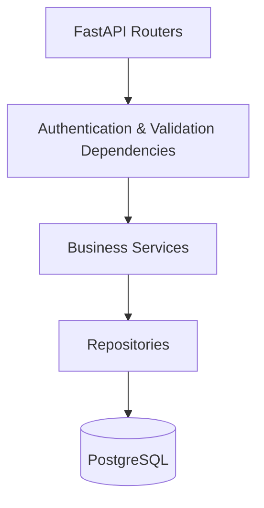
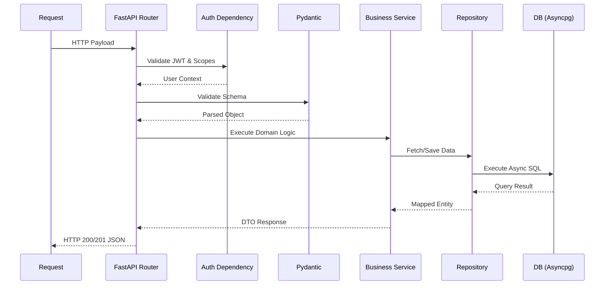
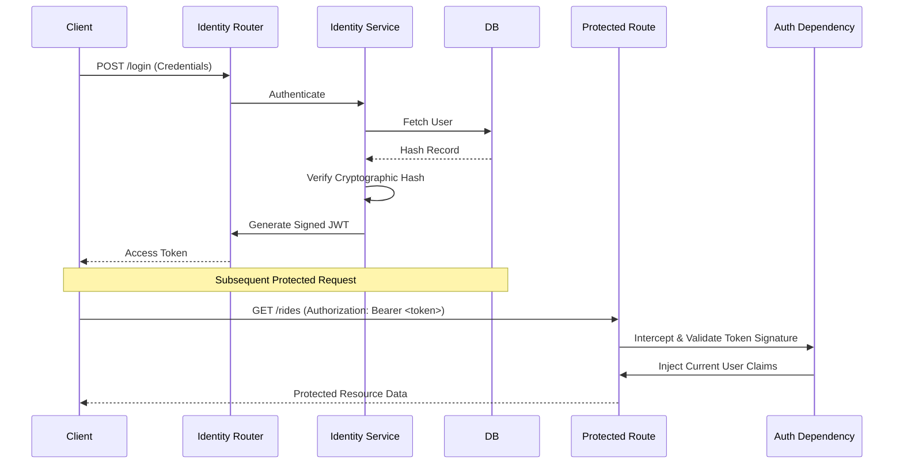

# Backend Architecture

## Executive Summary

The Raahi backend is the central nervous system of the enterprise carpooling platform. It operates as the authoritative source of truth, responsible for managing user identity, executing complex ride-matching heuristics, maintaining precise digital wallet ledgers, and securely serving data to client applications.

The backend adopts a **Modular Monolith** architectural pattern leveraging **FastAPI (Python)** and **Async SQLAlchemy**. This pattern was specifically chosen to aggressively isolate business domains (Identity, Coordination, Wallet, Payments) while avoiding the operational overhead, network latency, and distributed transaction complexities of a microservices architecture during the initial growth phase. The core design principles emphasize asynchronous I/O for massive concurrency, strict payload validation at the network edge, and domain-driven decoupling of logic.

---

# Backend Folder Structure

```text
applications/backend_application/source/
├── application_startup/
│   ├── main.py
│   └── routers.py
├── shared_infrastructure/
│   ├── authentication/
│   ├── configuration/
│   ├── database/
│   └── exceptions/
├── modules/
│   ├── identity/
│   ├── journey_chat/
│   ├── notifications/
│   ├── payment_gateway/
│   ├── payment_processing/
│   ├── ride_coordination/
│   ├── ride_matching/
│   └── wallet/
└── database_seed/
```

- **`application_startup/`**: Bootstraps the FastAPI application. Responsible for router aggregation, CORS policy configuration, and global middleware initialization.
- **`shared_infrastructure/`**: Houses cross-cutting concerns. Contains the database connection pool configuration, global JWT validation dependencies, and shared utility functions utilized across the entire application.
- **`modules/`**: The core of the Modular Monolith. Each sub-directory represents an isolated business domain containing its own routers, domain services, repositories, and data schemas.
- **`database_seed/`**: Scripts and fixtures utilized to securely populate the database with initial configurations or mock data for local environments.

---

# Backend Layered Architecture

The backend strictly adheres to a layered architecture within each module to guarantee a clean separation of concerns.



- **Routers**: Map HTTP methods and endpoints to specific controller functions. Define the API contract via OpenAPI and Pydantic schemas.
- **Middleware / Dependencies**: Intercepts requests to assert authentication (JWT validity), role-based access control, and payload integrity. Invalid requests are rejected here before reaching business logic.
- **Services**: The core Business Logic Layer. Encapsulates domain rules, orchestrates operations across repositories, and facilitates inter-module communication.
- **Repositories**: The Data Access Layer. Abstracts SQLAlchemy ORM queries, providing a clean interface for the Service layer to perform CRUD operations without writing raw SQL.
- **Models / Schemas**: SQLAlchemy models map directly to PostgreSQL tables; Pydantic schemas validate incoming HTTP payloads and serialize outbound responses.

---

# Module Breakdown

| Module | Purpose | Business Responsibility | Database Entities | Connected APIs | Dependencies |
| :--- | :--- | :--- | :--- | :--- | :--- |
| **Identity** | User Management | Authentication, RBAC, employee verification. | Users, Roles | None | `shared_infrastructure` |
| **Ride Coordination** | Ride Lifecycle | Creating, joining, starting, and completing carpools. | Rides, RideRequests | None | `Identity`, `Ride Matching`, `Wallet` |
| **Ride Matching** | Geospatial Matching | Calculating detours, ETAs, and overlap efficiency. | None | Google Maps Platform | `Identity` |
| **Wallet** | Ledger Management | Tracking user balances, processing internal transfers safely. | Wallets, Transactions | None | `Identity` |
| **Payment Gateway** | Fiat Processing | Connecting to external gateways for wallet top-ups. | PaymentIntents | External Gateway API | `Wallet` |
| **Payment Processing** | Top-up Orchestration | Validating external webhooks, initiating wallet deposits. | None | None | `Payment Gateway`, `Wallet` |
| **Journey Chat** | Ride Messaging | Facilitating real-time communication between riders. | Messages | None | `Identity`, `Ride Coordination` |
| **Notifications** | Alerting | Dispatching push/in-app notifications for ride events. | Notifications | WhatsApp / FCM | `Identity` |

---

# Request Processing Pipeline



---

# Business Logic Layer

- **Implementation Location**: Business rules strictly reside within the `*_service.py` classes of each domain module.
- **Module Communication**: Modules communicate via clear, synchronous in-process method calls. A service in one module can inject and invoke a service from another (e.g., `RideCoordinationService` invoking `WalletService.transfer_funds()`).
- **Separation of Responsibilities**: Services are explicitly prohibited from executing raw SQL; they rely entirely on Repositories. Conversely, Routers never implement business logic; they are restricted to parsing input and formatting output.
- **Reusable Logic**: Cross-cutting utilities (like distance calculations or cryptographic token generation) are pushed down to `shared_infrastructure`, allowing any module to utilize them without creating cyclical dependencies.

---

# Database Interaction

- **ORM**: The backend utilizes **SQLAlchemy 2.0 (Async)**, providing a Pythonic interface to database interactions that prevents blocking the asynchronous event loop.
- **Repositories**: Data access logic is heavily localized in Repository classes. For instance, `UserRepository` handles all user-related queries exclusively.
- **Transactions**: SQLAlchemy's async sessions manage atomic transactions. The Service layer dictates transaction boundaries, committing upon success or rolling back upon exceptions to guarantee absolute data consistency across tables (e.g., when debiting one wallet and crediting another).
- **Connection Management**: A global connection pool (managed via `asyncpg`) is initialized precisely once during application startup and safely shared across all concurrent requests.

---

# Authentication & Authorization



- **Authentication Flow**: Entirely stateless. Valid credentials yield a cryptographically signed Access Token.
- **Token Validation**: FastAPI dependencies intercept protected routes, parse the Authorization header, verify the JWT signature locally (without a database lookup), and assert expiration.
- **Role-based Access**: Custom dependencies enforce scopes (e.g., `require_admin`). If the token's claims lack the required scope, a `403 Forbidden` response is returned immediately, terminating the request pipeline.

---

# Error Handling

- **Validation Errors**: Handled automatically by Pydantic. Malformed payloads are intercepted at the routing layer and return a `422 Unprocessable Entity` containing precise pointers to the invalid fields.
- **Business Errors**: Domain rule violations (e.g., "Insufficient Wallet Balance") throw custom Exception classes inheriting from a base application exception.
- **Exception Handling**: Global exception handlers intercept these custom exceptions and map them to appropriate HTTP status codes (e.g., `400 Bad Request` or `409 Conflict`), wrapping the error in a standardized JSON format.
- **Unexpected Exceptions**: Unhandled exceptions (`500 Internal Server Error`) are caught globally, logged securely with their full traceback, and obscured from the client to prevent infrastructure details from leaking.

---

# Configuration Management

- **Environment Variables**: Pydantic's `BaseSettings` handles `.env` file parsing, exposing strongly typed configuration classes with default fallbacks and strict validation.
- **Secrets Management**: JWT secret keys, database URIs, and external API tokens are injected purely via environment variables. No secrets are hardcoded.
- **Application Startup**: Configuration is instantiated exactly once during the `application_startup` phase.
- **Dependency Injection**: FastAPI's native Dependency Injection (DI) system provides configuration and database session contexts directly to the routing functions that need them.

---

# External Services

- **Maps (Google Maps Platform)**: The `ride_matching` module executes asynchronous REST calls to the Google Maps Distance Matrix and Directions APIs to calculate route efficiency and acceptable detour thresholds.
- **Payments (Gateway)**: The `payment_gateway` module initiates payment intents via external REST APIs and exposes a secure webhook endpoint to receive asynchronous success/failure confirmations from the provider.
- **Realtime (WhatsApp)**: The `notifications` module fires webhook events to the external Node.js WhatsApp microservice for dispatching conversational messages to end-users.

---

# Background Processing

- **Purpose**: Offloading non-critical or slow operations to ensure HTTP responses remain lightning-fast.
- **Workflow**: The backend utilizes FastAPI's native `BackgroundTasks`. When a business action concludes (e.g., a ride completes), tasks like dispatching WhatsApp notifications or calculating finalized ledger reports are added to the background queue and executed post-response.
- **Error Recovery**: The current implementation is lightweight; if a background task fails, it logs the error but does not feature automatic exponential backoff or retry logic.
- **Scalability**: *Explicitly noted:* There is currently no heavy distributed task queue (like Celery, RabbitMQ, or Redis RQ) implemented. Background tasks run in the memory space of the active Uvicorn worker.

---

# Backend Security

- **Authentication**: Stateless, cryptographically signed JWTs ensure sessions cannot be hijacked without the master signing key.
- **Authorization**: Route-level dependency-based RBAC strictly partitions Employee and Admin namespaces.
- **Input Validation**: Pydantic rigidly casts and validates all inputs, mitigating payload-based attacks.
- **CORS**: Configured strictly in `application_startup` to accept cross-origin requests exclusively from authorized frontend domains.
- **Secrets**: Excluded from version control entirely.
- **SQL Injection Prevention**: Entirely mitigated by the SQLAlchemy ORM, which forces parameterized queries for all database interactions.
- **XSS Prevention**: The backend strictly returns raw JSON payloads; DOM rendering and escaping are deferred entirely to the React frontends.

---

# Scalability Analysis

- **Strengths**: 
  - The combination of FastAPI and `asyncpg` yields exceptional horizontal scaling potential. The system can handle thousands of concurrent requests by avoiding thread starvation on I/O bounds.
  - The Modular Monolith pattern prevents database locking across unrelated domains, keeping the data layer fast.
  - Stateless JWTs allow the application to be placed behind any standard TCP/HTTP load balancer without requiring sticky sessions.
- **Limitations**:
  - `BackgroundTasks` run in the same memory space as the HTTP server; a massive spike in background jobs could temporarily starve the web server's resources.
  - Real-time features tied to local memory limit horizontal scaling capabilities for specific features like WebSockets without a distributed backplane.

---

# Technical Decisions

| Decision | Reason | Advantages | Trade-offs |
| :--- | :--- | :--- | :--- |
| **Framework: FastAPI** | High performance, native async support, built-in OpenAPI docs. | Rapid API development, automatic interactive documentation, extremely fast execution. | Steeper learning curve for developers unfamiliar with async Python patterns. |
| **Database: PostgreSQL** | Strict necessity for relational integrity (rides, users, ledgers). | Unmatched ACID compliance, robust constraints, extensible for geospatial data. | Harder to scale writes horizontally compared to NoSQL databases. |
| **ORM: SQLAlchemy 2.0 (Async)** | Prevents blocking the event loop during heavy database I/O. | Massive concurrency gains under load. | Complex initial setup for async sessions compared to traditional sync ORMs. |
| **Validation: Pydantic** | Native, deep integration with FastAPI. | Strong type safety, zero-boilerplate data validation, automatic serialization. | Minor parsing overhead on exceptionally large or deeply nested payloads. |
| **Architecture: Modular Monolith** | Balances domain isolation with deployment and operational simplicity. | Exceptionally easy to refactor; zero network latency between domain boundaries. | Cannot scale specific modules independently (e.g., scaling just the payments engine). |

---

# Future Improvements

- **Message Queues (Event-Driven Architecture)**: Replace FastAPI `BackgroundTasks` with a robust message queue (e.g., RabbitMQ or Kafka) for guaranteed delivery of critical background jobs (like payment reconciliation) and improved fault tolerance.
- **Redis Caching**: Implement Redis to cache repetitive, computationally expensive queries (such as Google Maps Distance Matrix limits or static user profiles) to drastically reduce database and third-party API load.
- **Distributed WebSocket State**: Integrate a Redis Pub/Sub backplane to allow WebSocket connections to span multiple horizontally scaled backend instances seamlessly.
- **Microservices Extraction**: As the active user base grows, the strict module boundaries will allow for the clean extraction of high-throughput modules (like `payment_processing` or `ride_matching`) into standalone, independently scalable microservices.
- **Monitoring & Distributed Tracing**: Implement OpenTelemetry to track request latency across modules, log raw database query times, and set up automated alerting for API degradation.
