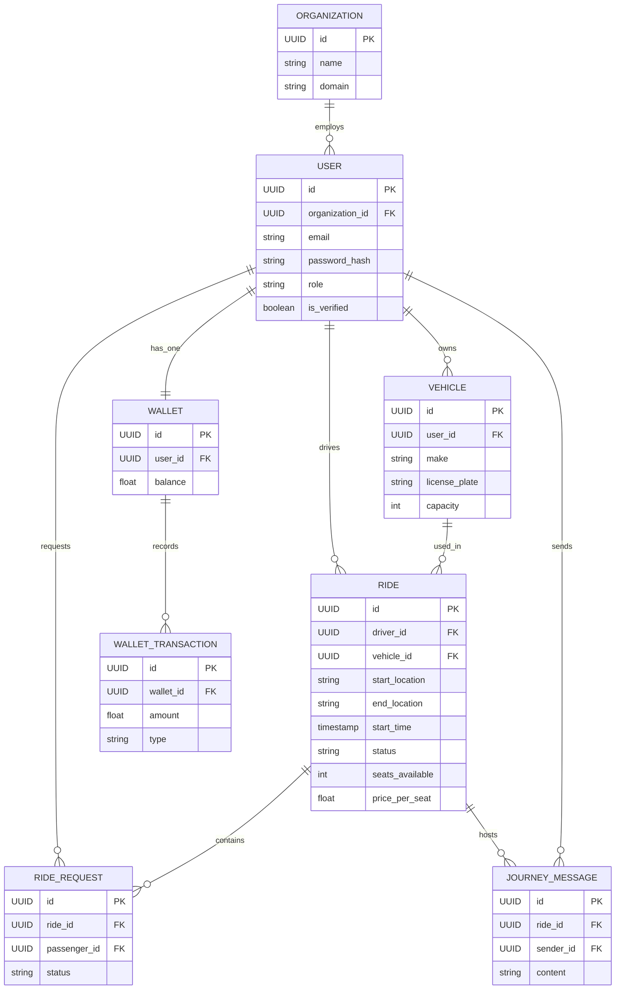
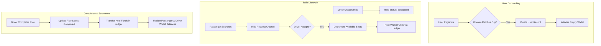

# Database Design

## Database Architecture Overview

The Raahi platform relies on a robust relational database architecture to guarantee data integrity, absolute transactional consistency (especially for financial ledgers), and complex relational querying. The database is highly normalized to minimize data redundancy and is designed to support multi-tenancy inherently through organizational isolation.

**Why this database was chosen**: 
PostgreSQL was selected due to its unmatched ACID compliance, robust concurrent transaction handling capabilities, and native support for advanced data types. These features are strictly essential for a carpooling ecosystem that manages real-time logistics alongside a digital currency wallet.

**Design Philosophy**: 
The schema follows strict normalization principles. Entities are heavily decoupled (e.g., `Vehicles` are independent of `Rides`) to ensure data accuracy. Crucially, the financial ledger is designed as an immutable, append-only structure to maintain an infallible audit trail.

---

# Database Overview

- **Database Technology**: PostgreSQL
- **ORM / Query Builder**: SQLAlchemy 2.0 (using the `asyncpg` asynchronous driver)
- **Migration System**: Alembic (tracks schema changes via version-controlled python scripts)
- **Connection Management**: A global asynchronous connection pool managed by `asyncpg`, instantiated at application startup to share connections efficiently across concurrent requests.
- **Multi-tenant Strategy**: Logical isolation via an `organization_id` foreign key on the `users` table. This allows the platform to serve multiple corporations simultaneously while strictly segregating their employee networks and rides.

---

# Entity Relationship Diagram (ERD)

---

# Database Schema

## Organizations
**Purpose**: Represents corporate entities registered on the platform.

| Column | Type | Constraints | Description |
| :--- | :--- | :--- | :--- |
| `id` | UUID | Primary Key | Unique identifier. |
| `name` | VARCHAR | Not Null | Corporate name. |
| `domain` | VARCHAR | Unique, Not Null | Corporate email domain for auto-verification (e.g., `google.com`). |
| `created_at`| TIMESTAMP | Default: NOW() | Audit timestamp. |

## Users
**Purpose**: Stores employee identities, credentials, and roles.

| Column | Type | Constraints | Description |
| :--- | :--- | :--- | :--- |
| `id` | UUID | Primary Key | Unique identifier. |
| `organization_id` | UUID | Foreign Key | Links to `Organizations.id`. |
| `email` | VARCHAR | Unique, Not Null | Employee corporate email address. |
| `password_hash` | VARCHAR | Not Null | Bcrypt hashed password. |
| `role` | VARCHAR | Not Null | User privileges (`employee` or `admin`). |
| `is_verified` | BOOLEAN | Default: False | Email verification status. |
| `created_at` | TIMESTAMP | Default: NOW() | Audit timestamp. |
| `updated_at` | TIMESTAMP | Default: NOW() | Audit timestamp. |

## Vehicles
**Purpose**: Stores vehicles registered by employees for driving.

| Column | Type | Constraints | Description |
| :--- | :--- | :--- | :--- |
| `id` | UUID | Primary Key | Unique identifier. |
| `user_id` | UUID | Foreign Key | Links to `Users.id` (Driver). |
| `make` | VARCHAR | Not Null | Vehicle brand and model. |
| `license_plate`| VARCHAR | Unique, Not Null | Vehicle registration number. |
| `capacity` | INTEGER | Not Null, > 0 | Maximum passenger seats available. |

## Rides
**Purpose**: Represents a scheduled or active carpool journey.

| Column | Type | Constraints | Description |
| :--- | :--- | :--- | :--- |
| `id` | UUID | Primary Key | Unique identifier. |
| `driver_id` | UUID | Foreign Key | Links to `Users.id`. |
| `vehicle_id` | UUID | Foreign Key | Links to `Vehicles.id`. |
| `start_location`| VARCHAR | Not Null | Origin coordinates or address. |
| `end_location` | VARCHAR | Not Null | Destination coordinates or address. |
| `start_time` | TIMESTAMP | Not Null | Scheduled departure time. |
| `status` | VARCHAR | Not Null | Lifecycle state (`scheduled`, `active`, `completed`, `cancelled`). |
| `seats_available`| INTEGER | Not Null, >= 0 | Remaining seats. Constrained to never drop below 0. |
| `price_per_seat`| DECIMAL | Not Null, >= 0 | Cost in platform currency. |

## Ride_Requests
**Purpose**: Tracks bookings made by passengers for specific rides.

| Column | Type | Constraints | Description |
| :--- | :--- | :--- | :--- |
| `id` | UUID | Primary Key | Unique identifier. |
| `ride_id` | UUID | Foreign Key | Links to `Rides.id`. |
| `passenger_id`| UUID | Foreign Key | Links to `Users.id`. |
| `status` | VARCHAR | Not Null | Booking state (`pending`, `accepted`, `rejected`, `completed`). |
| `created_at` | TIMESTAMP | Default: NOW() | Time of booking request. |

## Wallets
**Purpose**: Stores the current digital currency balance for users.

| Column | Type | Constraints | Description |
| :--- | :--- | :--- | :--- |
| `id` | UUID | Primary Key | Unique identifier. |
| `user_id` | UUID | Foreign Key, Unique | Links to `Users.id` (Strict 1:1 relationship). |
| `balance` | DECIMAL | Not Null, >= 0 | Current available funds. Constrained to prevent overdrafts. |

## Wallet_Transactions
**Purpose**: Immutable ledger recording every financial movement.

| Column | Type | Constraints | Description |
| :--- | :--- | :--- | :--- |
| `id` | UUID | Primary Key | Unique identifier. |
| `wallet_id` | UUID | Foreign Key | Links to `Wallets.id`. |
| `amount` | DECIMAL | Not Null | Transaction value. |
| `type` | VARCHAR | Not Null | Movement direction (`credit` or `debit`). |
| `reference_id`| UUID | Nullable | Links to a `Ride.id` or `PaymentIntent` for auditability. |
| `created_at` | TIMESTAMP | Default: NOW() | Immutable audit timestamp. |

## Journey_Messages
**Purpose**: Stores chat messages within a specific ride context.

| Column | Type | Constraints | Description |
| :--- | :--- | :--- | :--- |
| `id` | UUID | Primary Key | Unique identifier. |
| `ride_id` | UUID | Foreign Key | Links to `Rides.id`. |
| `sender_id` | UUID | Foreign Key | Links to `Users.id`. |
| `content` | TEXT | Not Null | Message body. |
| `created_at` | TIMESTAMP | Default: NOW() | Message timestamp. |

---

# Relationship Explanation

- **Organization → Employees (1:N)**: A corporate entity employs multiple users. This relationship enforces multi-tenancy, ensuring users can only view and carpool with colleagues within the identical corporate domain.
- **Employee → Vehicles (1:N)**: An employee can register multiple vehicles. This allows a driver to choose between a car or a motorcycle when publishing a ride.
- **Employee → Wallet (1:1)**: Every verified user receives exactly one digital wallet upon registration, centralizing all platform earnings and payment deductions.
- **Ride → Booking (1:N)**: A single ride accommodates multiple booking requests up to the vehicle's capacity.
- **Wallet → Transactions (1:N)**: A wallet possesses a historical ledger of multiple transactions. This relationship is strictly append-only, ensuring financial auditing integrity is never compromised.
- **Ride → Journey Messages (1:N)**: The ride acts as the aggregate root for all chat messages exchanged between the driver and approved passengers.

---

# Data Flow

---

# Data Integrity

- **Foreign Keys**: Enforced extensively across all tables to guarantee referential integrity (e.g., a `RideRequest` physically cannot exist for a deleted or non-existent `Ride`).
- **Unique Constraints**: Prevents duplicate accounts via unique `email` constraints, and prevents overlapping vehicles via unique `license_plate`.
- **Transactions**: Atomic SQLAlchemy asynchronous transactions guarantee that complex financial movements (e.g., debiting a passenger, crediting a driver, writing ledger entries) all succeed together or roll back entirely, preventing phantom money generation or loss.
- **Validation Constraints**: Database `CHECK` constraints (e.g., `seats_available >= 0`, `balance >= 0`) act as the absolute final line of defense against application-level logic bugs or race conditions.

---

# Indexing Strategy

| Index Target | Purpose | Performance Benefit |
| :--- | :--- | :--- |
| **Primary Keys (UUID)** | Uniqueness and default clustering | Ensures extremely fast, precise lookups by entity ID. |
| **Foreign Keys** (`user_id`, `ride_id`) | Join optimization | Drastically speeds up relational queries (e.g., finding all historical rides for a specific user). |
| **`Users.email`** | Login lookups | Ensures rapid query response during the authentication flow. |
| **`Rides.start_time`** | Filtering scheduled rides | Rapidly filters out past or completed rides during passenger searches. |
| **`Rides.status`** | State filtering | Quickly separates active journeys from historical data. |

*Future Recommendation*: As the platform scales, a composite index on `(status, start_location, end_location, start_time)` should be implemented to optimize the core geospatial ride-matching read queries.

---

# Query Patterns

- **Ride Search**: The heaviest read operation. Queries the `Rides` table where `status = 'scheduled'` and `seats_available > 0`, explicitly joined with `Users` and filtered by the searcher's `organization_id`.
- **Wallet Transactions**: Queries `Wallet_Transactions` filtered by `wallet_id`, ordered by `created_at DESC` for pagination. The localized ledger structure makes this a highly efficient, single-table read.
- **Vehicle Lookup**: A simple indexed lookup on `Vehicles` by `user_id` when a driver is publishing a new ride.

---

# Business Rules Enforced by Database

- **No Negative Balances**: A strict database `CHECK` constraint on the `Wallets` table ensures `balance >= 0`, physically preventing overdrafts regardless of application-level race conditions.
- **Seat Availability Integrity**: A `CHECK` constraint ensures `seats_available >= 0`, making double-booking physically impossible at the storage layer.
- **Organization Isolation**: Enforced implicitly through table joins; users cannot belong to multiple organizations simultaneously, ensuring data leaks between corporate tenants do not occur at the row level.

---

# Database Security

- **Access Control**: Database credentials are strictly managed via environment variables. The FastAPI backend connects using an application-specific PostgreSQL role with limited privileges.
- **ORM Protection**: SQLAlchemy completely abstracts SQL query construction, utilizing parameterized queries universally. This structurally eliminates SQL Injection (SQLi) vulnerabilities.
- **Migration Safety**: Alembic ensures all schema modifications are version-controlled, testable, and capable of clean rollbacks in case of deployment failures.
- **Sensitive Data Storage**: Passwords are never stored in plaintext; they are irreversibly hashed using the robust bcrypt algorithm before insertion.
- **UUID Keys**: Replacing sequential integers with UUIDv4 primary keys prevents Insecure Direct Object Reference (IDOR) attacks and resource enumeration by malicious users.

---

# Performance Considerations

- **Read-Heavy Operations**: Ride searching is the most read-heavy operation. It is currently optimized by B-Tree indexes on time and status columns.
- **Write-Heavy Operations**: The Wallet Ledger and Journey Chat receive the highest volume of writes. The schema isolates these into narrow, append-only tables to avoid locking contention on core entities.
- **Joins**: Minimized where possible. For instance, `RideRequest` tracks its own `status` to avoid constantly needing to join the parent `Ride` just to check if the journey is completed.
- **Pagination**: Implemented via `LIMIT` and `OFFSET` on all unbounded list endpoints (e.g., transaction history, chat history) to prevent unbounded memory consumption and excessive I/O.

---

# Technology Decisions

| Decision | Reason | Advantages | Trade-offs |
| :--- | :--- | :--- | :--- |
| **PostgreSQL** | Strict necessity for ACID compliance and robust constraints for financial data. | Incredibly reliable, supports advanced JSON/geospatial extensions natively. | Harder to shard globally compared to NoSQL databases. |
| **SQLAlchemy Async** | Requires async I/O to maximize FastAPI concurrency. | Highly performant, prevents event loop blocking on heavy queries. | Complex session management compared to synchronous equivalents. |
| **UUID Primary Keys** | Security against enumeration; vastly simplifies multi-region data merging. | Highly secure, globally unique. | Slightly larger index size and marginally slower insertion than sequential integers. |
| **Append-Only Ledger** | Financial integrity and auditability requirement. | Infallible transaction history, easy reconciliation. | Storage size grows continuously without archiving strategies. |

---

# Future Improvements

- **PostGIS Integration**: Migrate `start_location` and `end_location` columns to PostGIS `GEOMETRY` types. Implement spatial indexing (GiST) to allow true radius-based ride searching (e.g., "Find rides starting within 2km of my location").
- **Redis Caching**: Cache static `Users` profiles and active `Rides` to significantly reduce the read load on the PostgreSQL primary node.
- **Read Replicas**: Introduce a PostgreSQL read replica to handle heavy analytical queries from the Admin Portal without impacting the performance of the core transaction engine.
- **Archiving**: Implement a scheduled background job to migrate `completed` rides and chat messages older than 1 year to cold storage. This will keep the hot tables small and index lookups blazingly fast.
