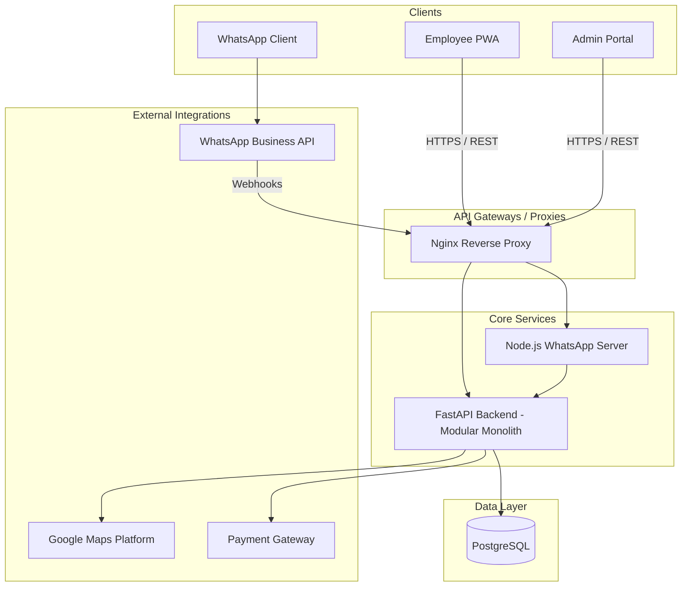
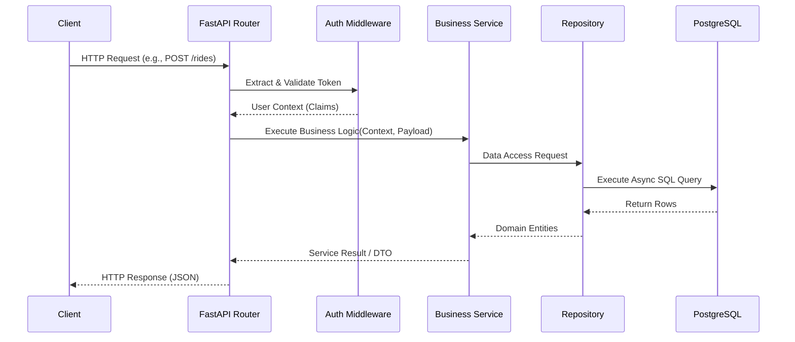
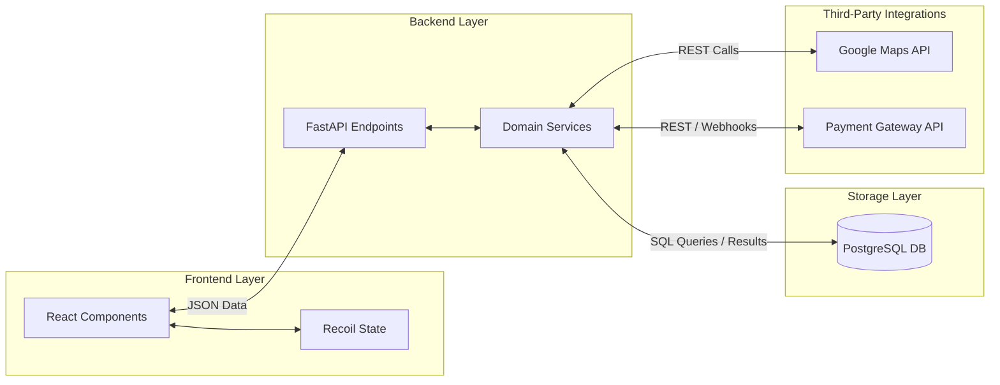
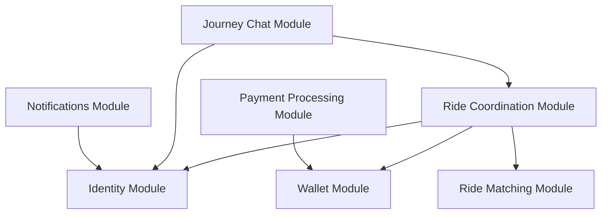
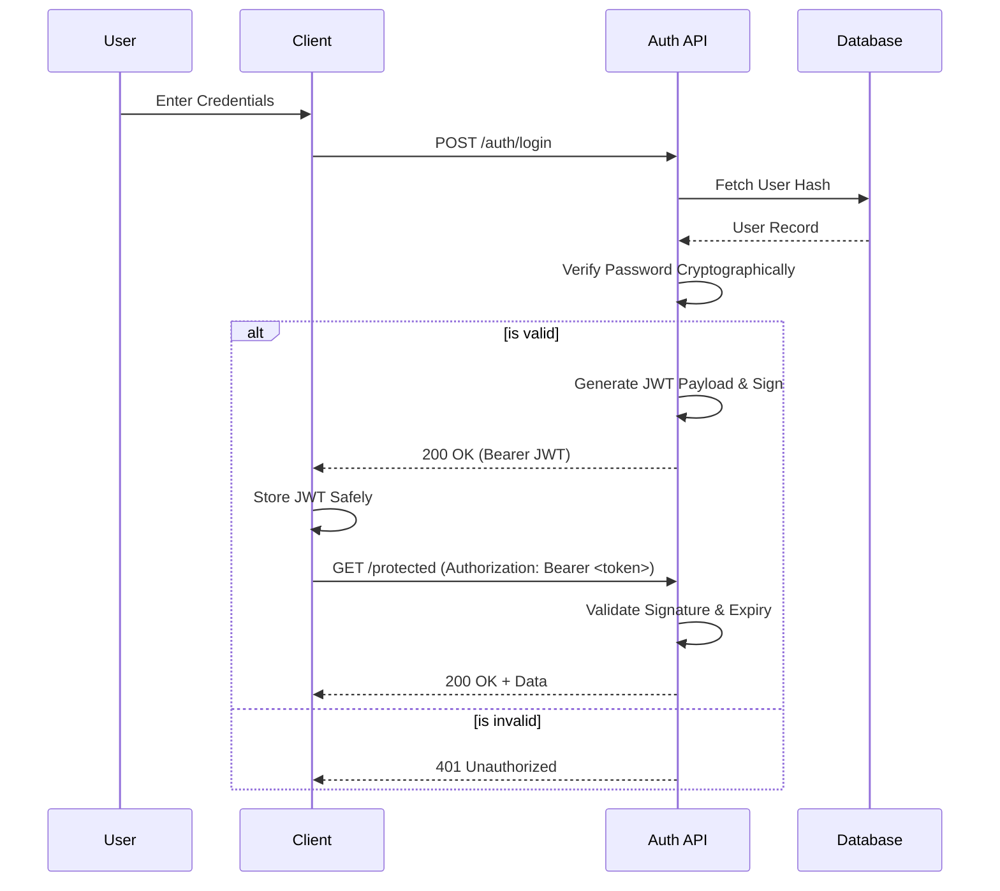

# System Architecture

## Overview

Raahi is an enterprise-grade commute and carpooling platform designed to optimize corporate mobility, reduce transportation costs, and lower carbon footprints. The architecture follows a Modular Monolith design on the core backend, paired with responsive progressive web applications (PWAs) for clients, and a dedicated microservice for WhatsApp integration. 

This architecture was specifically chosen to balance the operational simplicity of a single deployable backend unit with the strict domain isolation necessary for future scalability. By enforcing strict boundaries between modules (Identity, Coordination, Payments), the system maintains high maintainability while minimizing the complexities of a fully distributed microservices architecture during its initial growth phase.

---

# High-Level Architecture

The system comprises three primary client interfaces (Employee PWA, Administration Portal, WhatsApp Bot), a core asynchronous FastAPI backend, a Node.js webhook server, and a PostgreSQL relational database. Traffic is typically routed through an Nginx reverse proxy.

---

# System Components

| Component | Purpose | Responsibilities | Inputs | Outputs | Dependencies | Interactions with other components |
| :--- | :--- | :--- | :--- | :--- | :--- | :--- |
| **Employee PWA** | Primary end-user interface | Ride booking, matching, wallet management, chat | User interactions, GPS | REST API calls, UI rendering | FastAPI Backend, GMaps JS API | Communicates with Backend via REST APIs. |
| **Admin Portal** | Organizational management | User verification, analytics, system health monitoring | Admin configurations | Data visualizations | FastAPI Backend | Invokes privileged REST API endpoints. |
| **WhatsApp Server** | Conversational UI | Handling WhatsApp webhooks, parsing user intents | Webhook JSON payloads | WhatsApp messages | WhatsApp Business API, FastAPI Backend | Forwards user intents to FastAPI, relays responses to WA. |
| **FastAPI Backend** | Core business logic engine | Identity, ride coordination, payments, matching | REST requests | JSON responses | PostgreSQL, GMaps API, Payment Gateway | Central hub; acts as the authoritative source of truth. |
| **PostgreSQL Database** | Persistent data storage | Storing users, rides, wallets, messages | SQL queries | Query results | None | Queried exclusively by the FastAPI Backend. |

---

# Request Lifecycle

The following sequence outlines a typical HTTP request lifecycle through the backend application.

---

# Data Flow

---

# Module Interaction

The FastAPI backend strictly isolates domains into modules to prevent tight coupling and spaghetti code.

| Module | Responsibilities | Dependencies | Communication | Data Exchanged |
| :--- | :--- | :--- | :--- | :--- |
| **Identity** | User auth, roles, verification | None | In-process calls | User Profiles, Auth Contexts |
| **Ride Coordination** | Ride lifecycle (create, join, complete) | Identity, Matching, Wallet | In-process calls | Ride Objects, Status Updates |
| **Ride Matching** | Distance matrices, route overlap | Google Maps API | In-process calls | Coordinates, ETA, Detour Metrics |
| **Wallet** | Ledger, balance management | None | In-process calls | Transaction Records, Balances |
| **Payment Processing** | Gateway integration, top-ups | Wallet, Payment Gateway | In-process calls, Webhooks | Payment Intents, Status |
| **Journey Chat** | Ride-specific messaging | Identity, Coordination | In-process calls | Messages, Timestamps |
| **Notifications** | Dispatching alerts | Identity | In-process calls | Alerts, Device Tokens |

---

# External Integrations

### Google Maps Platform
- **Purpose**: Precise routing, geocoding, and distance matrix calculations.
- **Why it exists**: Core to ride matching; evaluating carpool detours requires highly accurate geospatial mapping to ensure ride feasibility.
- **Where it is used**: `ride_matching` backend module and frontend map components.
- **Failure handling**: Implements retry mechanisms for transient API limits; degrades gracefully to direct-line distance heuristics if the API is completely unavailable.

### Payment Gateway
- **Purpose**: Processing fiat currency to digital wallet top-ups.
- **Why it exists**: Enables users to seamlessly fund their commute wallet without handling cash.
- **Where it is used**: `payment_gateway` and `payment_processing` backend modules.
- **Failure handling**: Relies on webhook reconciliation to handle delayed or failed asynchronous transactions; implements idempotent transaction records to prevent double-charging.

### WhatsApp Business API
- **Purpose**: Conversational bot interaction.
- **Why it exists**: Provides low-friction, on-the-go access to the platform without requiring a dedicated app download.
- **Where it is used**: Node.js WhatsApp Server.
- **Failure handling**: Messages are queued implicitly by WhatsApp; explicit error messages are relayed to the user if intent parsing fails or backend timeouts occur.

---

# Authentication Flow

---

# Scalability Considerations

- **Horizontal Scaling**: The FastAPI backend is completely stateless—session state is stored entirely within cryptographically signed JWTs. This allows the backend to be horizontally scaled simply by adding instances behind a load balancer.
- **Database Growth**: PostgreSQL inherently supports massive datasets. Read-replicas can be easily introduced to handle heavy read operations (e.g., ride searching, analytics) without impacting the primary write node.
- **Real-time Communication**: Currently, real-time events rely on the application instance. As concurrent connections grow, this will necessitate a distributed pub/sub broker to sync connection states.
- **Strengths**: The asynchronous I/O model (FastAPI + Asyncpg) allows a single backend instance to handle thousands of concurrent requests without thread starvation.
- **Limitations**: In-process state (such as tracking active WebSocket connections for chat) is limited to the single instance handling the request, which currently restricts seamless multi-node websocket horizontal scaling.

---

# Error Handling Strategy

- **Validation**: Strict input validation occurs at the system edge using Pydantic models. Malformed requests are rejected immediately with a `422 Unprocessable Entity` before hitting business logic.
- **Exception Handling**: Global exception handlers trap domain-specific errors (e.g., `InsufficientFundsError`, `RideFullError`) and map them to appropriate HTTP status codes (e.g., `400 Bad Request`).
- **API Errors**: Standardized JSON error structures are returned for all failures, containing an error code, user-friendly message, and optional details.
- **Logging**: The application logs capture stack traces and context exclusively for `500 Internal Server Error` events, ensuring root-cause debuggability without leaking sensitive backend details to the client.
- **Fallback behavior**: API timeouts fail fast to prevent cascading system failures.

---

# Security Overview

- **Authentication**: Stateless, cryptographically signed JSON Web Tokens (JWT).
- **Authorization**: Granular Role-Based Access Control (RBAC) securely separates `Employee` and `Admin` operations.
- **Secrets**: Handled strictly via environment variables (`.env`); no credentials or API keys exist in the source code.
- **Input Validation**: Strongly typed Pydantic schemas inherently prevent SQL injection and cross-site scripting (XSS) payload ingestion.
- **API Protection**: Route-level dependency injection in FastAPI enforces token presence and validates scopes prior to service execution.

---

# Technology Mapping

| Layer | Technology | Purpose | Reason for choosing |
| :--- | :--- | :--- | :--- |
| **API Backend** | FastAPI (Python) | Core Business Logic | Extremely fast execution, native async support, automated OpenAPI documentation, excellent Pydantic integration. |
| **Database** | PostgreSQL | Data Persistence | Highly reliable, ACID compliant, robust support for relational entities and complex querying. |
| **ORM** | SQLAlchemy (Async) | Database Abstraction | Safe SQL generation, async capability prevents event-loop blocking on heavy I/O database calls. |
| **Frontend UI** | React + Vite | Web Applications | Fast build times (Vite), massive ecosystem, component-based UI paradigm. |
| **State Management** | Recoil | Frontend State | Minimal boilerplate, fine-grained reactivity avoiding unnecessary re-renders. |
| **Styling** | Tailwind CSS | UI Styling | Utility-first approach accelerates prototyping and ensures a highly consistent design system. |
| **Microservice** | Node.js + Express | WhatsApp Bot | High I/O throughput for webhooks, straightforward integration with WhatsApp Business APIs. |

---

# Design Decisions

- **Decision**: Modular Monolith architecture over Microservices.
  - **Reason**: The project maturity favored a single deployable unit to avoid distributed system complexities such as network latency, distributed tracing, and complex transactions.
  - **Advantages**: Easier deployment, simpler debugging, faster initial feature delivery, and refactoring safety.
  - **Trade-offs**: Tight coupling risk if module boundaries aren't strictly respected; independent scaling of specific features (e.g., just scaling the wallet) is not currently possible.
- **Decision**: Asynchronous Python (FastAPI + Asyncpg).
  - **Reason**: The platform requires a high volume of I/O bound operations (DB queries, Google Maps API calls, Payment Gateway requests).
  - **Advantages**: Capable of handling massive concurrency efficiently on minimal hardware.
  - **Trade-offs**: Requires strict adherence to async programming patterns; accidentally introducing synchronous blocking code can severely degrade event loop performance.

---

# Future Improvements

- **Message Queues (Event-Driven Architecture)**: Introducing RabbitMQ or Apache Kafka for cross-module communication (e.g., a Ride Completion event triggering a Wallet transfer asynchronously). This would further decouple services and increase fault tolerance.
- **Redis Caching & State Store**: Implementing Redis to cache computationally expensive operations (like Google Maps Distance Matrix results) and to act as a distributed state store for scaling WebSockets across multiple backend instances.
- **Container Orchestration**: Migrating to Kubernetes to manage containerized deployments, enabling auto-scaling and robust health-check routing.
- **Microservices Extraction**: As domain boundaries are already strictly defined, high-throughput modules like the `Payment Processing` or the `WhatsApp Server` can be safely extracted into independent microservices as traffic demands dictate.
- **Monitoring & Observability**: Integrating Prometheus for metrics gathering and Grafana for dashboards to provide comprehensive system observability, tracing, and automated alerting.
