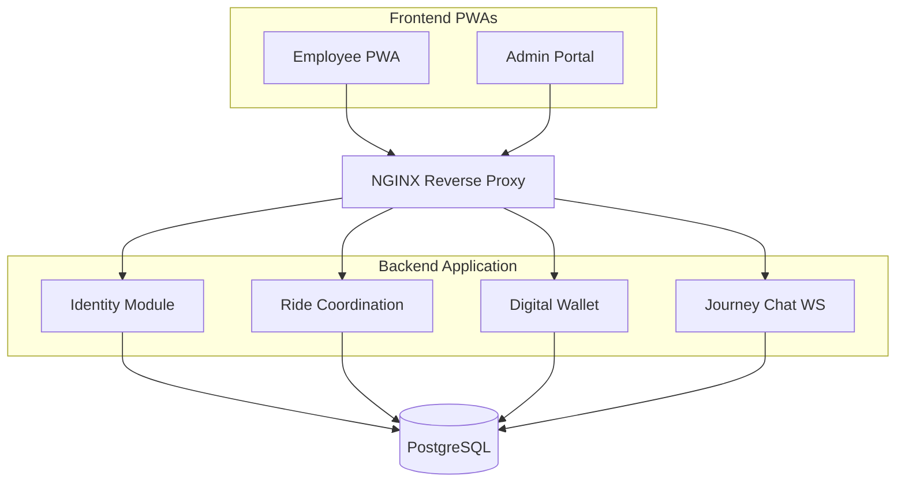
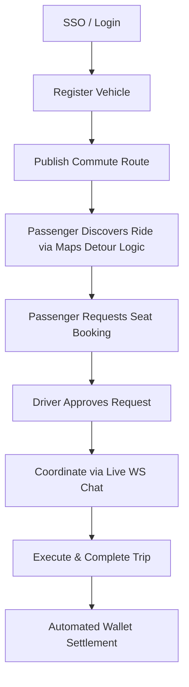

# Project Overview

Raahi is an enterprise-grade, closed-network corporate carpooling platform designed to reduce daily commuting friction and organizational carbon emissions. It seamlessly connects employees within the same corporation to share daily commutes securely, featuring intelligent geospatial ride matching, real-time logistics coordination, and an integrated digital wallet for instant, cashless cost-sharing.

---

# Problem Statement

Daily corporate commuting suffers from severe inefficiencies: massive carbon footprints from single-occupancy vehicles, exorbitant parking infrastructure costs for employers, and a fundamental lack of trust in public ride-sharing networks. Employees want to carpool to save money, but lack a secure, organization-isolated platform that handles the complex logistics of route matching and fair financial settlement.

---

# Solution

Raahi solves this by providing a highly secure, multi-tenant platform restricted strictly to verified corporate email domains. By leveraging external Maps APIs for intelligent detour filtering, integrated digital wallets for atomic payment settlements, and WebSockets for real-time pickup coordination, Raahi transforms disjointed commuting into an automated, trusted, and environmentally sustainable corporate benefit.

---

# Key Features

### Identity & Security
- **Domain Verification**: Organization-isolated registration via strict corporate email domain checks.
- **Stateless Auth**: JWT authentication with granular Role-Based Access Control (RBAC).

### Ride Coordination
- **Ride Publishing**: Drivers set origins, destinations, schedules, and vehicle physical capacities.
- **Geospatial Discovery**: Passengers discover rides filtered strictly by time constraints and mathematically acceptable driver detours.
- **Seat Management**: Real-time decrementing of available seats upon driver approval to prevent overbooking.

### Trip Execution & Comms
- **Trip State Machine**: Managed transitions from Scheduled → Active → Completed.
- **Journey Chat**: Real-time, ride-specific WebSocket messaging for micro-coordinating pickups safely.

### Financials
- **Digital Wallet**: Integrated ledger for users to top-up via external gateways (Razorpay).
- **Atomic Settlements**: Frictionless, automated wallet-to-wallet transfers instantly upon trip completion.

### Administration
- **Admin Portal**: Dedicated dashboard for monitoring corporate metrics, carbon savings, and employee management.

---

# Technical Architecture

The platform utilizes a **Modular Monolith** architecture to maintain strict domain boundaries without the operational overhead of microservices.

---

# Technology Stack

| Layer | Technology | Purpose |
| :--- | :--- | :--- |
| **Frontend** | React, TypeScript, Vite | Delivers highly responsive, installable Progressive Web Apps (PWAs). |
| **Backend API** | Python 3, FastAPI, Uvicorn | High-performance asynchronous REST API and WebSocket handling. |
| **Database** | PostgreSQL 16 | Relational data persistence with strict ACID compliance. |
| **Reverse Proxy**| NGINX | Single-domain routing, completely eliminating frontend CORS issues. |
| **Orchestration**| Docker & Docker Compose| Containerizes the entire stack for deterministic, reproducible deployments. |
| **External APIs** | Google Maps, Razorpay | Geospatial detour math and fiat payment processing. |

---

# Innovation

- **Geospatial Hybrid Matching**: Instead of forcing the driver to manually evaluate passenger requests, the search algorithm preemptively filters out passengers whose pickup/drop-off locations would cause a detour exceeding strict time thresholds, ensuring incredibly high driver adoption.
- **Atomic Wallet Settlements**: Solves the awkwardness of peer-to-peer payments by utilizing a strict dual-entry database ledger. Funds are automatically deducted and instantly transferred *only* upon successful trip completion.
- **Domain-Driven Modular Monolith**: Architected like microservices (strict folder isolation, service-to-service communication) but deployed as a monolith, ensuring flawless local development and zero distributed transaction complexity.

---

# End-to-End Workflow

---

# Challenges Solved

- **The Overbooking Race Condition**: Solved using PostgreSQL check constraints and atomic transactions, mathematically guaranteeing a vehicle's capacity is never physically exceeded even under highly concurrent booking requests.
- **The "Stranger Danger" Problem**: Solved via strict multi-tenant organizational isolation. Database queries inherently mandate that a user can only ever interact with colleagues sharing their verified corporate email domain.

---

# Scalability

- **Stateless Architecture**: The FastAPI backend utilizes stateless JWTs, allowing horizontal scaling across infinite nodes.
- **Database Indexing**: Heavy B-Tree indexing on `organization_id` and `start_time` ensures instantaneous query execution before the memory-intensive Maps API spatial filtering occurs.
- **Containerization**: The entire stack is completely Dockerized, making it trivial to lift-and-shift into Kubernetes (EKS/GKE) or AWS ECS.

---

# Security

- **Authentication**: Cryptographically verified JSON Web Tokens (JWT) mapped to specific role scopes (`admin`, `employee`).
- **Data Isolation**: Multi-tenant architecture securely isolates corporate data strictly at the database query level.
- **Financial Integrity**: Append-only digital ledger utilizing PostgreSQL `CHECK` constraints to mathematically guarantee a wallet balance never accidentally drops below zero.

---

# Future Scope

*The following are realistic architectural roadmap items:*
- **PostGIS Integration**: Moving detour calculation natively into the PostgreSQL engine using spatial bounding boxes to entirely eliminate the Google Maps API bottleneck during peak search hours.
- **Dynamic Pricing Algorithms**: Automatically adjusting recommended seat prices based on real-time organizational demand and route complexity.
- **Recurring Ride Templates**: Allowing drivers to publish a Monday-Friday commute schedule instantly.

---

# Demo Checklist

1. **Onboarding**: Show the PWA login screen. Register an employee and verify the email domain organizational lock.
2. **Publishing**: Switch to the Driver view. Register a dummy vehicle and publish a ride from location A to B.
3. **Discovery**: Switch to a Passenger view. Search for a ride from A to B. Emphasize how the Google Maps integration calculates the detour time instantly to surface the best match.
4. **Booking**: Request a seat. Switch to the driver view to approve it. Demonstrate the real-time decrement of available seats.
5. **Coordination**: Open the Journey Chat feature to show real-time WebSocket communication between the Driver and Passenger.
6. **Settlement**: Complete the trip as the Driver. Open both Wallets to demonstrate the atomic financial settlement reflecting instantly.
7. **Analytics**: Open the Admin Portal to show the aggregated carbon offset and organizational metrics.

---

# One-Minute Elevator Pitch

"Raahi is an enterprise-grade corporate carpooling platform designed to eliminate commuting friction and drastically reduce organizational carbon footprints. By securing users strictly inside verified corporate silos, we solve the 'stranger danger' of public ride-sharing networks. Under the hood, Raahi utilizes intelligent geospatial detour filtering, real-time WebSocket communication, and an integrated digital ledger to make sharing a ride as effortless as swiping an office badge. It’s highly scalable, mathematically secure, and architected as a modular monolith ready for modern cloud deployment."
