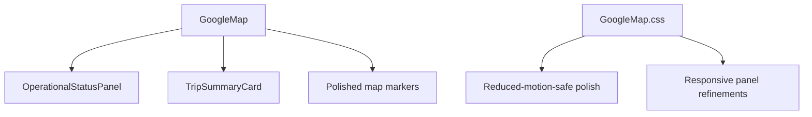
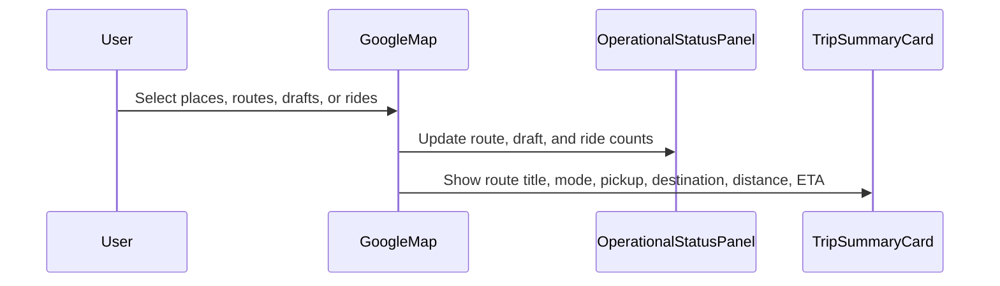

# Google Maps Phase 10

## Overview

Phase 10 adds hackathon polish to the Google Maps experience. It improves the trip card, marker styling, operational status, lightweight motion, and responsive demo presentation while preserving the working map-first application.

## Architecture



## Request Flow



## Folder Structure

```text
source/components/google-maps/OperationalStatusPanel.tsx
source/components/google-maps/TripSummaryCard.tsx
source/components/google-maps/GoogleMap.css
docs/google-maps/phase-10.md
```

## Testing

- Run `npm run build`.
- Run `npm run typecheck`.
- Run `npm test`.
- Verify operational status updates from real route, draft, and discovery counts.
- Verify trip card displays route title and travel mode.
- Verify reduced-motion preference disables hover motion.
- Verify mobile panel remains scrollable and readable.

## Troubleshooting

| Issue | Likely Cause | Resolution |
| --- | --- | --- |
| Status count looks wrong | Discovery filters are active | Check Nearby Rides count after filter changes |
| Hover motion is absent | Reduced-motion is enabled | This is expected for accessibility |
| Trip card mode says Driving | Travel mode defaults to DRIVE | Select a different route mode in Route Options |

## Validation

- [x] UI remains map-first and demo-ready.
- [x] Operational status uses live frontend state.
- [x] Trip card includes route title and travel mode.
- [x] Marker styling is clearer for pickup, destination, and ride clusters.
- [x] Lightweight motion respects reduced-motion preferences.

## Future Roadmap

- Add brand-aligned assets after final product design approval.
- Add guided demo data from backend once APIs exist.
- Add visual regression testing before final merge.

## Merge Readiness

- Changes remain inside the Google Maps application and `docs/google-maps`.
- No root configuration was modified.
- Future merge risk is contained to the Google Maps feature branch.
