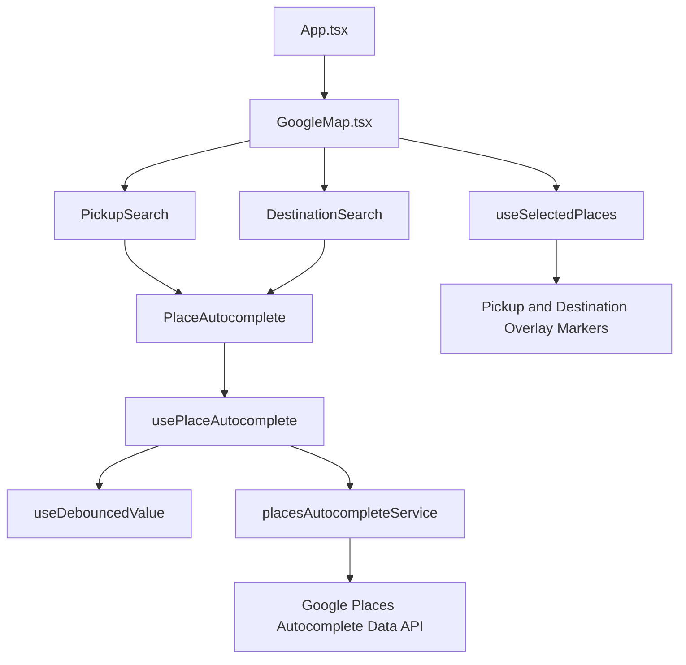
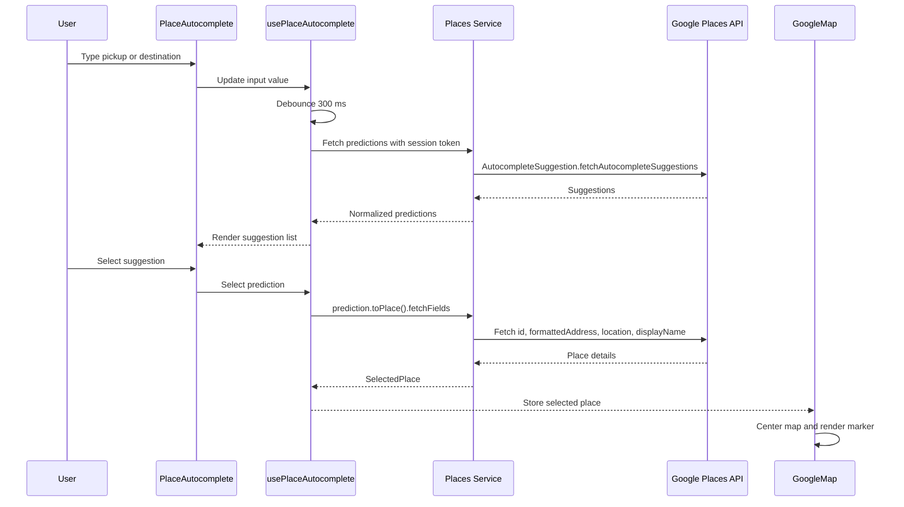

# Google Maps Phase 2

## Objective

Phase 2 adds reusable Google Places Autocomplete for pickup and destination search in the Enterprise Carpooling Platform.

This phase is limited to location search and map centering. It does not add route calculation, Directions API, ETA, ride booking, backend services, authentication, payments, or live tracking.

## Architecture

The implementation uses Google Maps JavaScript API with the Places library loaded through `@react-google-maps/api`.

| Layer | Responsibility |
| --- | --- |
| Map shell | Loads Google Maps, renders the full-screen map, stores selected pickup/destination, centers the map after selection |
| Search components | Render pickup and destination search inputs |
| Shared autocomplete component | Handles input UI, suggestions, keyboard navigation, loading, empty, and error states |
| Hooks | Debounce input, manage autocomplete state, manage selected places |
| Places service | Calls Google Places Autocomplete Data API and resolves selected place details |
| Types | Defines reusable place and coordinate contracts |

## Component Diagram



## Google Places Request Flow



## Implemented Features

| Requirement | Status |
| --- | --- |
| Pickup Search Component | Complete |
| Destination Search Component | Complete |
| Shared reusable `PlaceAutocomplete` component | Complete |
| Google Places API integration | Complete |
| Debounced search | Complete |
| Keyboard navigation | Complete |
| Place selection | Complete |
| Store `placeId`, formatted address, latitude, longitude | Complete |
| Automatically center map after selection | Complete |
| Pickup marker | Complete |
| Destination marker | Complete |
| TypeScript types | Complete |
| Reusable hooks | Complete |
| Reusable service layer | Complete |
| Responsive UI | Complete |
| Loading state | Complete |
| Empty state | Complete |
| API error handling | Complete |
| No hardcoded API keys | Complete |

## Data Stored on Selection

Only the fields needed by Phase 2 are stored:

| Field | Purpose |
| --- | --- |
| `placeId` | Stable Google Place identifier for future APIs |
| `formattedAddress` | Human-readable selected location |
| `lat` | Latitude for map centering and future trip forms |
| `lng` | Longitude for map centering and future trip forms |

## Testing Guide

Start the app:

```bash
npm install
npm run dev
```

Build validation:

```bash
npm run build
```

Manual browser checks:

- [ ] Map loads full-screen.
- [ ] Current Location button still works.
- [ ] Pickup search returns suggestions after typing at least 2 characters.
- [ ] Destination search returns suggestions after typing at least 2 characters.
- [ ] Loading state appears while suggestions are being fetched.
- [ ] Empty state appears when no suggestions are available.
- [ ] API errors show inline without crashing the app.
- [ ] `ArrowDown` moves to the next suggestion.
- [ ] `ArrowUp` moves to the previous suggestion.
- [ ] `Enter` selects the highlighted suggestion.
- [ ] `Escape` closes the suggestion list.
- [ ] Mouse click selects a suggestion.
- [ ] Selecting pickup centers the map and adds a pickup marker.
- [ ] Selecting destination centers the map and adds a destination marker.
- [ ] No route line, ETA, booking, backend, auth, payments, or tracking features appear.

## Troubleshooting

| Issue | Cause | Resolution |
| --- | --- | --- |
| No suggestions appear | Input is shorter than 2 characters or Places API is not enabled | Type more characters and confirm Places API is enabled |
| Places error appears | API key restrictions, billing, or Places API access issue | Check Google Cloud API restrictions, billing, and allowed APIs |
| Map loads but autocomplete fails | Maps JavaScript API works, but Places library/API is blocked | Confirm the key can use Places API |
| Selection does not center map | Place details did not return a valid location | Try another place and check Places API details access |
| Keyboard selection does not work | Suggestion list is closed or no highlighted item exists | Type again, then use arrow keys before pressing Enter |
| Browser location fails | User denied permission or browser geolocation unavailable | Allow location permission or continue with map search |

## Security Notes

- The real Google Maps API key stays in `.env`.
- Source code reads the key through environment configuration.
- The key value is not hardcoded in React, TypeScript, docs, or HTML.
- For browser use, restrict the key with HTTP referrer restrictions.
- Restrict the browser key to only the APIs required by the frontend.
- Monitor Google Cloud usage during the hackathon.

## Validation Checklist

- [ ] `npm run build` passes.
- [ ] Browser console has no errors.
- [ ] Browser console has no deprecated marker warning.
- [ ] Pickup autocomplete works.
- [ ] Destination autocomplete works.
- [ ] Debounced search works.
- [ ] Keyboard navigation works.
- [ ] Selected pickup stores `placeId`, `formattedAddress`, `lat`, and `lng`.
- [ ] Selected destination stores `placeId`, `formattedAddress`, `lat`, and `lng`.
- [ ] Pickup marker appears.
- [ ] Destination marker appears.
- [ ] Map centers after each selection.
- [ ] No route calculation is implemented.
- [ ] No backend is implemented.
- [ ] No Directions API or ETA is implemented.
- [ ] No ride booking or matching is implemented.
- [ ] No tracking is implemented.

## Phase 2 Completion Criteria

Phase 2 is complete when both pickup and destination can be searched, selected, stored, shown on the map, and used to center the map while keeping the implementation limited strictly to Places Autocomplete.
