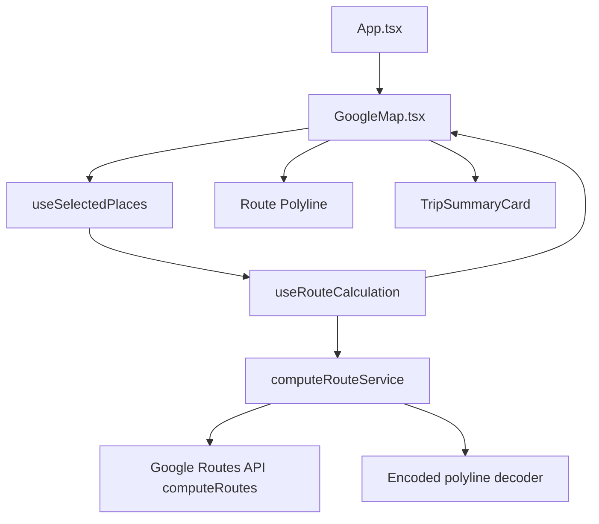
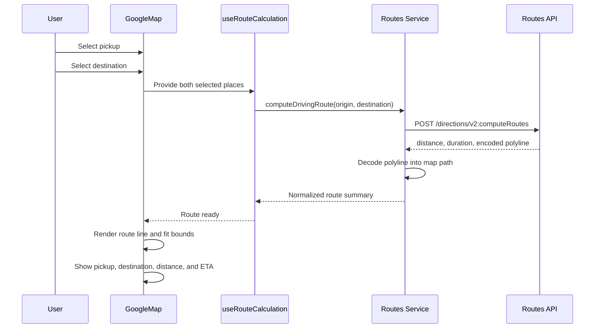

# Google Maps Phase 3

## Objective

Phase 3 adds route calculation and a trip preview between selected pickup and destination points in the Enterprise Carpooling Platform.

This phase is limited to frontend route calculation, route display, and trip preview. It does not add backend services, fare estimation, ride booking, rider-driver matching, payments, authentication, live tracking, route alternatives, saved trips, or driver assignment.

## Architecture

The implementation uses the Google Routes API `computeRoutes` endpoint after both pickup and destination places have been selected.

| Layer | Responsibility |
| --- | --- |
| Map shell | Renders pickup and destination markers, route polyline, and route calculation states |
| Trip summary component | Displays selected pickup, destination, distance, and ETA after route calculation |
| Route hook | Watches selected pickup and destination, manages loading/error/route state, rejects same-place inputs, and cancels stale requests |
| Routes service | Validates route inputs, calls Google Routes API, normalizes route distance, ETA, duration, and polyline data |
| Types | Defines reusable route calculation request, route summary, place, and coordinate contracts |

## Component Diagram



## Route Request Flow



## Implemented Features

| Requirement | Status |
| --- | --- |
| Automatic route calculation after pickup and destination selection | Complete |
| Routes API `computeRoutes` integration | Complete |
| Explicit response field mask | Complete |
| Driving route mode | Complete |
| Traffic-aware routing preference | Complete |
| Metric units | Complete |
| Encoded polyline request | Complete |
| Frontend polyline decoder | Complete |
| Route line on map | Complete |
| Map bounds fit to calculated route | Complete |
| Distance display | Complete |
| ETA display | Complete |
| Pickup display in Trip Summary Card | Complete |
| Destination display in Trip Summary Card | Complete |
| Trip Summary Card component | Complete |
| Loading state | Complete |
| API error state | Complete |
| No route found state | Complete |
| Invalid input state | Complete |
| Stale request cancellation | Complete |
| No hardcoded API keys | Complete |

## Fields Requested From Routes API

The service requests only the fields needed for this phase:

```text
routes.duration,routes.distanceMeters,routes.polyline.encodedPolyline
```

| Field | Purpose |
| --- | --- |
| `routes.duration` | Displays estimated drive time |
| `routes.distanceMeters` | Displays route distance |
| `routes.polyline.encodedPolyline` | Draws the route path on the map |

## Trip Summary Card

The Trip Summary Card appears only after a pickup, destination, and route are available.

| Field | Source |
| --- | --- |
| Pickup | Selected pickup `formattedAddress` |
| Destination | Selected destination `formattedAddress` |
| Distance | Routes API `routes.distanceMeters` formatted for users |
| ETA | Routes API `routes.duration` formatted for users |

## Error Handling

| State | Behavior |
| --- | --- |
| Loading | Shows route calculation progress after both places are selected |
| Invalid input | Rejects missing API key, invalid coordinates, and same pickup/destination |
| No route found | Shows a route-specific error when Routes API returns no drawable route |
| API error | Shows a route-specific error when Routes API rejects or fails the request |
| Stale request | Cancels outdated route requests when pickup or destination changes |

## Testing Guide

Start the app:

```bash
npm install
copy .env.example .env
npm run dev
```

Local configuration:

- Create an untracked `.env` file inside `applications/google_maps_carpooling_platform`.
- Set `GOOGLE_MAPS_API_KEY` to a real Google Maps Platform browser key.
- The Vite configuration exposes the value to the app as `VITE_GOOGLE_MAPS_API_KEY`.
- Restart `npm run dev` after changing `.env`.
- Verify the app leaves the map configuration error screen and loads the map.

Build validation:

```bash
npm run build
```

Manual browser checks:

- [ ] Map loads full-screen.
- [ ] Pickup search still returns suggestions.
- [ ] Destination search still returns suggestions.
- [ ] Selecting only pickup does not calculate a route.
- [ ] Selecting only destination does not calculate a route.
- [ ] Selecting both pickup and destination shows a route loading state.
- [ ] Route line appears after calculation.
- [ ] Trip Summary Card displays pickup.
- [ ] Trip Summary Card displays destination.
- [ ] Trip Summary Card displays distance.
- [ ] Trip Summary Card displays ETA.
- [ ] Map fits to the calculated route.
- [ ] Same pickup and destination shows an invalid input error.
- [ ] No-route responses show a route error without crashing the app.
- [ ] Changing pickup recalculates the route.
- [ ] Changing destination recalculates the route.
- [ ] Current Location still works.
- [ ] Browser console has no errors.
- [ ] No booking, matching, backend, auth, payment, or live tracking features appear.

## Troubleshooting

| Issue | Cause | Resolution |
| --- | --- | --- |
| Route error appears | Routes API is blocked, billing is unavailable, key restrictions do not allow the request, or no route exists | Check Google Cloud billing, Routes API access, API key restrictions, and selected places |
| No route appears | Pickup or destination is missing, the locations are the same, or Routes API returned no valid route | Select two different locations and try another destination |
| Build fails on Google Maps types | Google Maps type package or API usage changed | Reinstall dependencies and check `@types/google.maps` compatibility |
| Route line appears but looks simplified | The phase requests an overview polyline | Use high-quality polyline later if turn-by-turn precision is needed |

## Security Notes

- The real Google Maps API key stays in `.env`.
- Source code reads the key through environment configuration.
- The key value is not hardcoded in React, TypeScript, docs, or HTML.
- For browser use, restrict the key with HTTP referrer restrictions.
- Monitor Routes API usage during the hackathon because each route calculation is a billable request.
- For production, move server-side route calculations to a backend with a server-restricted key.

## Validation Checklist

- [x] `npm run build` passes.
- [x] Browser console has no errors.
- [x] Pickup autocomplete works.
- [x] Destination autocomplete works.
- [x] Route calculation works after both places are selected.
- [x] Trip Summary Card displays pickup.
- [x] Trip Summary Card displays destination.
- [x] Route distance appears.
- [x] Route ETA appears.
- [x] Route polyline appears.
- [x] Map fits to route bounds.
- [x] Invalid route inputs are handled.
- [x] No-route responses are handled.
- [x] No hardcoded API key is present outside `.env`.
- [x] No backend is implemented.
- [x] No ride booking or matching is implemented.
- [x] No tracking is implemented.

## Future Roadmap

- Move production route calculation to a backend service with a server-restricted key.
- Add waypoint support when the carpooling workflow needs intermediate stops.
- Add integration tests with mocked Routes API responses.
- Add production monitoring for route failures and quota usage.

## Merge Readiness

- Changes remain inside the Google Maps application and `docs/google-maps`.
- No backend, admin portal, booking, matching, payment, or tracking modules are modified.
- The real API key remains outside source control.
- Future merge risk is limited to the Google Maps feature branch surface.

## Phase 3 Completion Criteria

Phase 3 is complete when selecting a pickup and destination automatically calculates a driving route, draws it on the map, fits the map to the route, and displays a Trip Summary Card with pickup, destination, distance, and ETA while keeping the implementation limited strictly to route calculation and visualization.
