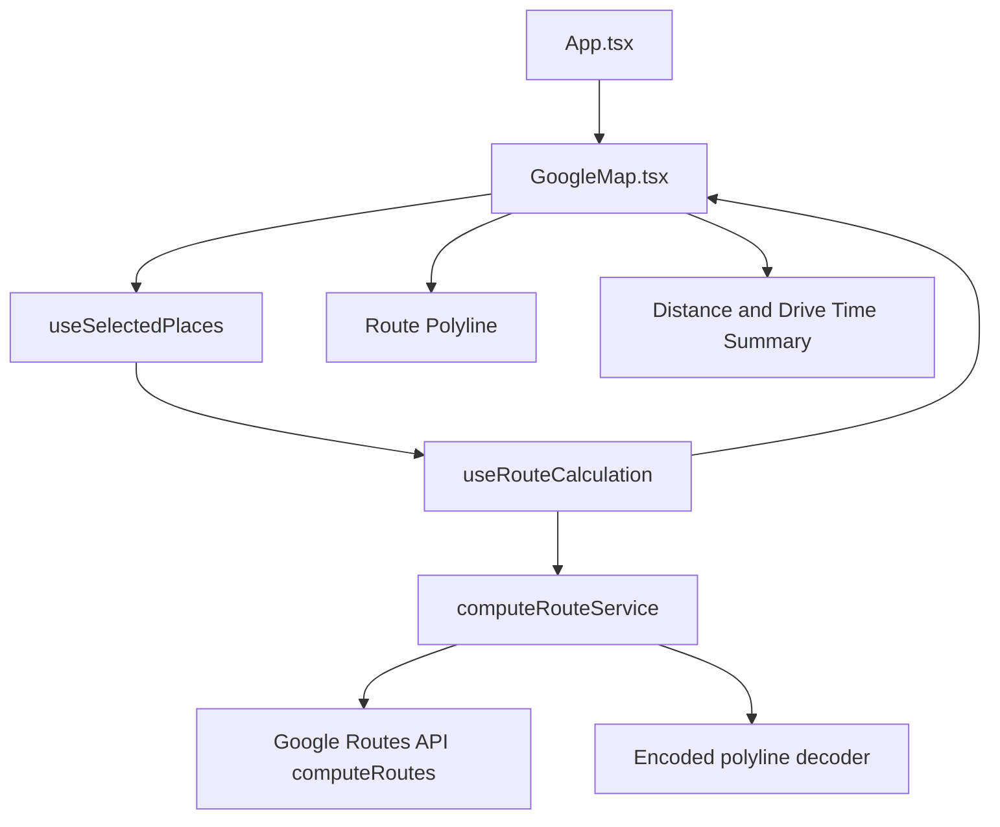
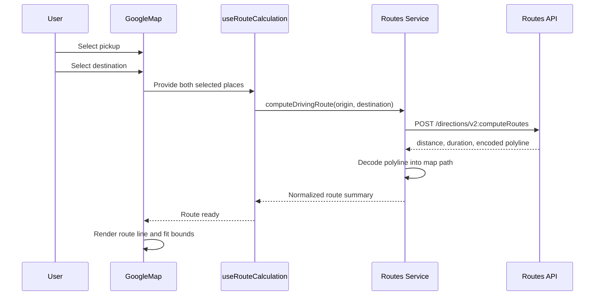

# Google Maps Phase 3

## Objective

Phase 3 adds route calculation between selected pickup and destination points in the Enterprise Carpooling Platform.

This phase is limited to frontend route calculation and route display. It does not add backend services, ride booking, rider-driver matching, payments, authentication, live tracking, route alternatives, saved trips, or driver assignment.

## Architecture

The implementation uses the Google Routes API `computeRoutes` endpoint after both pickup and destination places have been selected.

| Layer | Responsibility |
| --- | --- |
| Map shell | Renders pickup and destination markers, route polyline, and route summary |
| Route hook | Watches selected pickup and destination, manages loading/error/route state, cancels stale requests |
| Routes service | Calls Google Routes API and normalizes route distance, duration, and polyline data |
| Types | Defines reusable route summary and coordinate contracts |

## Component Diagram



## Route Request Flow



## Implemented Features

| Requirement | Status |
| --- | --- |
| Automatic route calculation after pickup and destination selection | Complete |
| Routes API `computeRoutes` integration | Complete |
| Explicit response field mask | Complete |
| Driving route mode | Complete |
| Traffic-aware routing preference | Complete |
| Metric units | Complete |
| Encoded polyline request | Complete |
| Frontend polyline decoder | Complete |
| Route line on map | Complete |
| Map bounds fit to calculated route | Complete |
| Distance display | Complete |
| Drive time display | Complete |
| Loading state | Complete |
| API error state | Complete |
| Stale request cancellation | Complete |
| No hardcoded API keys | Complete |

## Fields Requested From Routes API

The service requests only the fields needed for this phase:

```text
routes.duration,routes.distanceMeters,routes.polyline.encodedPolyline
```

| Field | Purpose |
| --- | --- |
| `routes.duration` | Displays estimated drive time |
| `routes.distanceMeters` | Displays route distance |
| `routes.polyline.encodedPolyline` | Draws the route path on the map |

## Testing Guide

Start the app:

```bash
npm install
npm run dev
```

Build validation:

```bash
npm run build
```

Manual browser checks:

- [ ] Map loads full-screen.
- [ ] Pickup search still returns suggestions.
- [ ] Destination search still returns suggestions.
- [ ] Selecting only pickup does not calculate a route.
- [ ] Selecting only destination does not calculate a route.
- [ ] Selecting both pickup and destination shows a route loading state.
- [ ] Route line appears after calculation.
- [ ] Route summary displays distance.
- [ ] Route summary displays drive time.
- [ ] Map fits to the calculated route.
- [ ] Changing pickup recalculates the route.
- [ ] Changing destination recalculates the route.
- [ ] Current Location still works.
- [ ] Browser console has no errors.
- [ ] No booking, matching, backend, auth, payment, or live tracking features appear.

## Troubleshooting

| Issue | Cause | Resolution |
| --- | --- | --- |
| Route error appears | Routes API is blocked, billing is unavailable, or key restrictions do not allow the request | Check Google Cloud billing, Routes API access, and API key restrictions |
| No route appears | Pickup or destination is missing, or Routes API returned no valid route | Select both locations and try another destination |
| Build fails on Google Maps types | Google Maps type package or API usage changed | Reinstall dependencies and check `@types/google.maps` compatibility |
| Route line appears but looks simplified | The phase requests an overview polyline | Use high-quality polyline later if turn-by-turn precision is needed |

## Security Notes

- The real Google Maps API key stays in `.env`.
- Source code reads the key through environment configuration.
- The key value is not hardcoded in React, TypeScript, docs, or HTML.
- For browser use, restrict the key with HTTP referrer restrictions.
- Monitor Routes API usage during the hackathon because each route calculation is a billable request.
- For production, move server-side route calculations to a backend with a server-restricted key.

## Validation Checklist

- [x] `npm run build` passes.
- [x] Browser console has no errors.
- [x] Pickup autocomplete works.
- [x] Destination autocomplete works.
- [x] Route calculation works after both places are selected.
- [x] Route distance appears.
- [x] Route drive time appears.
- [x] Route polyline appears.
- [x] Map fits to route bounds.
- [x] No hardcoded API key is present outside `.env`.
- [x] No backend is implemented.
- [x] No ride booking or matching is implemented.
- [x] No tracking is implemented.

## Phase 3 Completion Criteria

Phase 3 is complete when selecting a pickup and destination automatically calculates a driving route, draws it on the map, and displays route distance and drive time while keeping the implementation limited strictly to route calculation and visualization.
