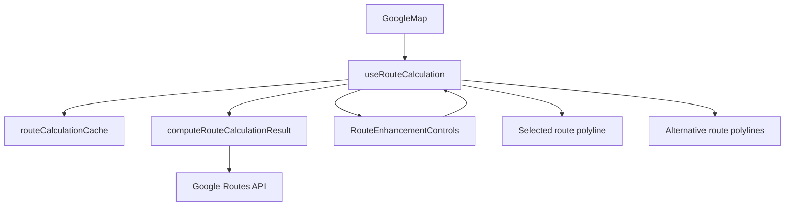
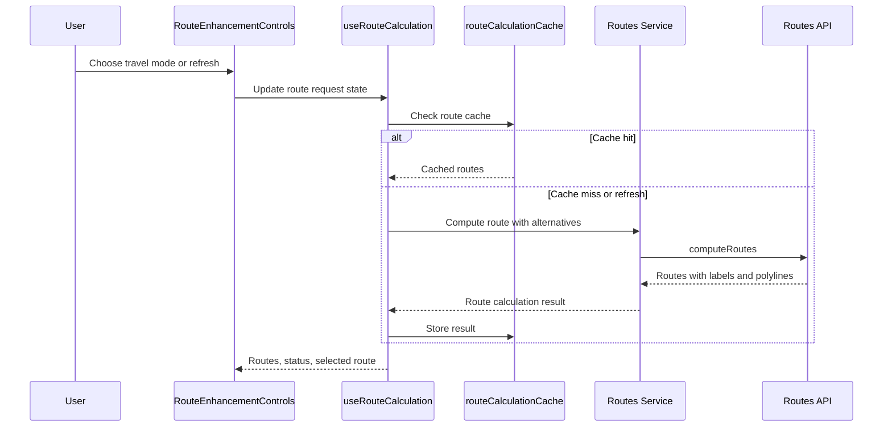

# Google Maps Phase 4

## Overview

Phase 4 enhances route calculation without adding backend services. The map can request route alternatives, switch travel modes, refresh cached routes, retry failed route requests, and preserve waypoint-ready request contracts.

## Architecture



## Request Flow



## Folder Structure

```text
source/components/google-maps/RouteEnhancementControls.tsx
source/hooks/google-maps/useRouteCalculation.ts
source/services/google-maps/computeDrivingRoute.ts
source/services/google-maps/routeCalculationCache.ts
source/types/google-maps/routeSummary.ts
```

## Testing

- Run `npm run build`.
- Run `npx tsc -b --pretty false`.
- Verify map selection still calculates a default route.
- Verify refresh retries a route request.
- Verify travel mode changes recalculate the route.
- Verify alternatives appear only when the Routes API returns more than one route.

## Troubleshooting

| Issue | Likely Cause | Resolution |
| --- | --- | --- |
| Alternatives do not appear | Routes API returned only the default route | Continue showing the single route |
| Refresh appears unchanged | Cache bypass worked but route result was equivalent | Confirm network call and selected route status |
| Travel mode fails | The selected mode is unavailable for the chosen points or key restrictions | Try driving mode and confirm Routes API access |

## Validation

- [x] Route contracts support travel mode, route labels, cache keys, and waypoint-ready inputs.
- [x] Route cache can be bypassed with refresh.
- [x] Retry reuses refresh behavior after API errors.
- [x] Alternative route UI is conditional.
- [x] No backend, booking, payment, or tracking behavior was added.

## Future Roadmap

- Replace frontend route calls with backend-protected routing for production.
- Add waypoint selection when the carpooling flow requires stops.
- Use server-side observability for route API failures.

## Merge Readiness

- Changes remain inside the Google Maps application and `docs/google-maps`.
- No dependency or global configuration changes are required.
- Future merge risk is limited to the long-lived Google Maps feature branch surface.
