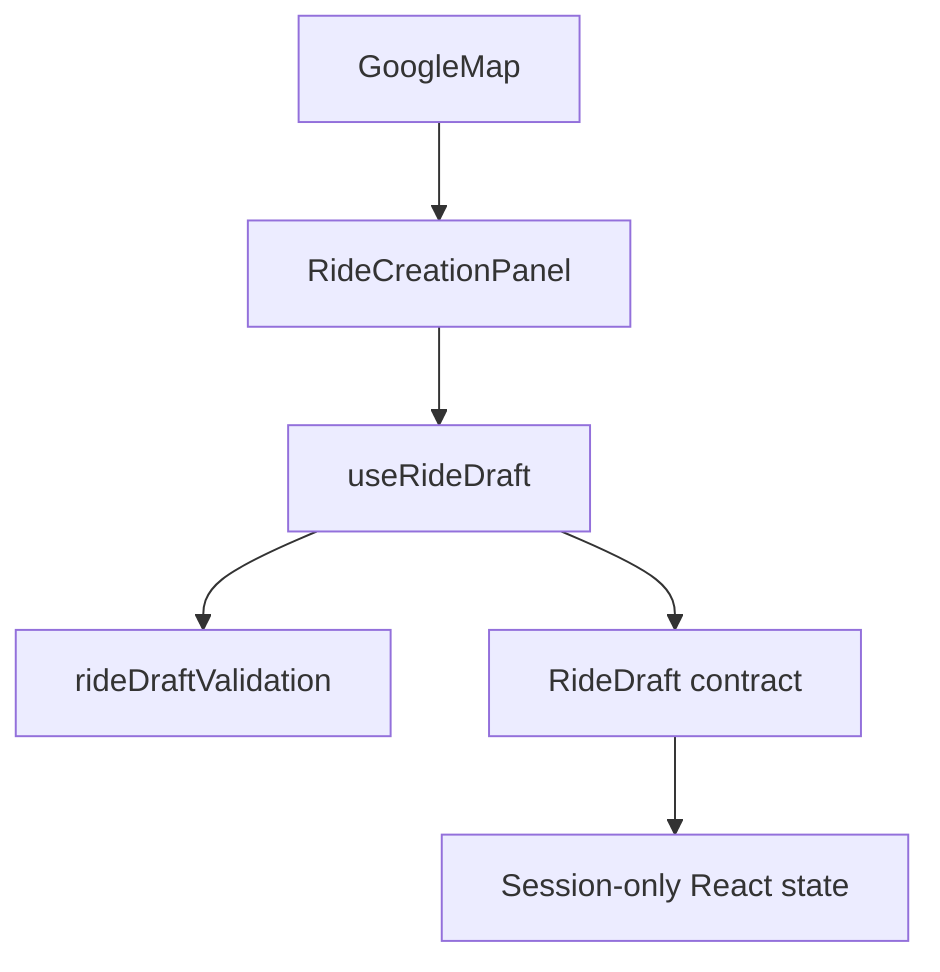
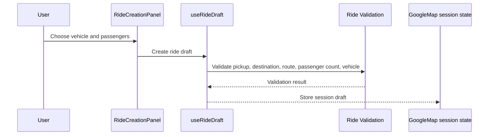

# Google Maps Phase 5

## Overview

Phase 5 adds the frontend foundation for creating a ride draft from the selected pickup, destination, and route. The draft is stored only in React session state and does not call a backend.

## Architecture



## Request Flow



## Folder Structure

```text
source/components/google-maps/RideCreationPanel.tsx
source/hooks/google-maps/useRideDraft.ts
source/services/google-maps/rideDraftValidation.ts
source/types/google-maps/rideDraft.ts
```

## Testing

- Run `npm run build`.
- Run `npx tsc -b --pretty false`.
- Verify the panel blocks draft creation until pickup, destination, and route exist.
- Verify passenger count stays between 1 and 6.
- Verify saved drafts are counted in the current session.

## Troubleshooting

| Issue | Likely Cause | Resolution |
| --- | --- | --- |
| Save button disabled | Missing pickup, destination, or route | Select both places and wait for route calculation |
| Passenger count will not increase | Maximum passenger count reached | Use another draft for larger groups later |
| Draft disappears on reload | Session-only storage is intentional | Backend persistence is out of scope for this phase |

## Validation

- [x] Ride draft contracts are strongly typed.
- [x] Draft validation is isolated in a service.
- [x] Vehicle selection is a placeholder only.
- [x] No backend, booking, matching, payment, or persistence was added.

## Future Roadmap

- Replace session state with backend ride creation.
- Connect vehicle options to organization vehicle inventory.
- Add authorization before production ride creation.

## Merge Readiness

- Changes remain inside the Google Maps application and `docs/google-maps`.
- No dependency or global configuration changes are required.
- Future merge risk remains low because the ride draft foundation is frontend-only.
