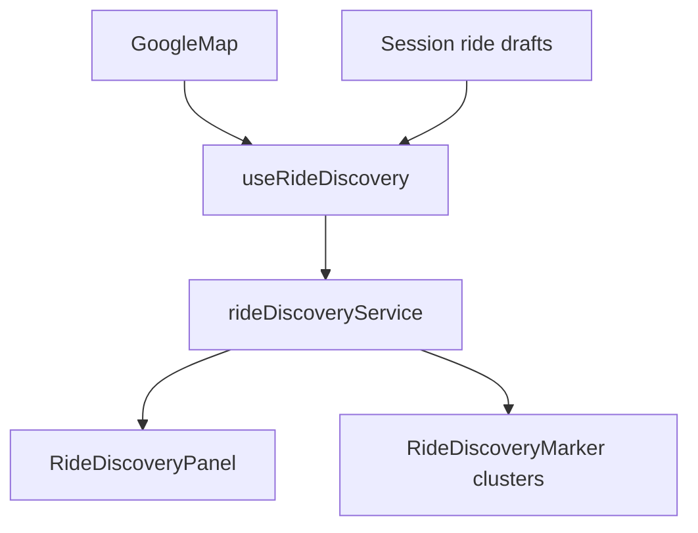
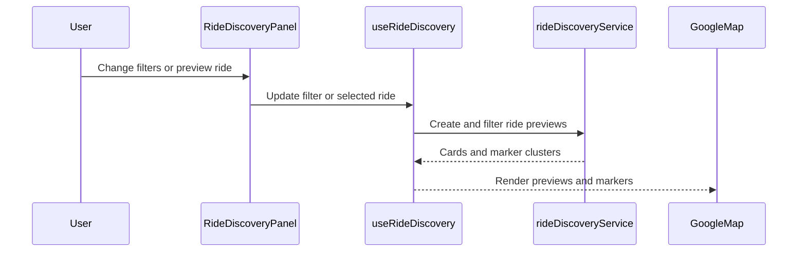

# Google Maps Phase 6

## Overview

Phase 6 adds frontend-only ride discovery. It combines session-created ride drafts with curated demo rides, displays ride cards, applies simple filters, and renders clustered pickup markers on the map.

## Architecture



## Request Flow



## Folder Structure

```text
source/components/google-maps/RideDiscoveryPanel.tsx
source/hooks/google-maps/useRideDiscovery.ts
source/services/google-maps/rideDiscoveryService.ts
source/types/google-maps/rideDiscovery.ts
```

## Testing

- Run `npm run build`.
- Run `npx tsc -b --pretty false`.
- Verify curated rides appear without a backend.
- Verify saved session drafts appear in discovery.
- Verify vehicle and seat filters update the list.
- Verify clustered ride markers render on the map.

## Troubleshooting

| Issue | Likely Cause | Resolution |
| --- | --- | --- |
| Few rides appear | Filters are restrictive | Reset vehicle to any and seats to 1 |
| Session draft disappears | Page was reloaded | Session-only state is expected until backend storage exists |
| Marker count is grouped | Pickup points share a rounded location bucket | Use the ride cards for individual preview selection |

## Validation

- [x] Ride discovery models are strongly typed.
- [x] Curated demo rides require no backend.
- [x] Session drafts feed discovery.
- [x] Filtering remains frontend-only.
- [x] Marker clustering abstraction is local to the Google Maps module.

## Future Roadmap

- Replace curated rides with backend discovery.
- Add backend geospatial search and matching.
- Replace lightweight clustering with production clustering if ride density grows.

## Merge Readiness

- Changes remain inside the Google Maps application and `docs/google-maps`.
- No dependency or global configuration changes are required.
- Discovery is isolated from backend and admin portal modules.
