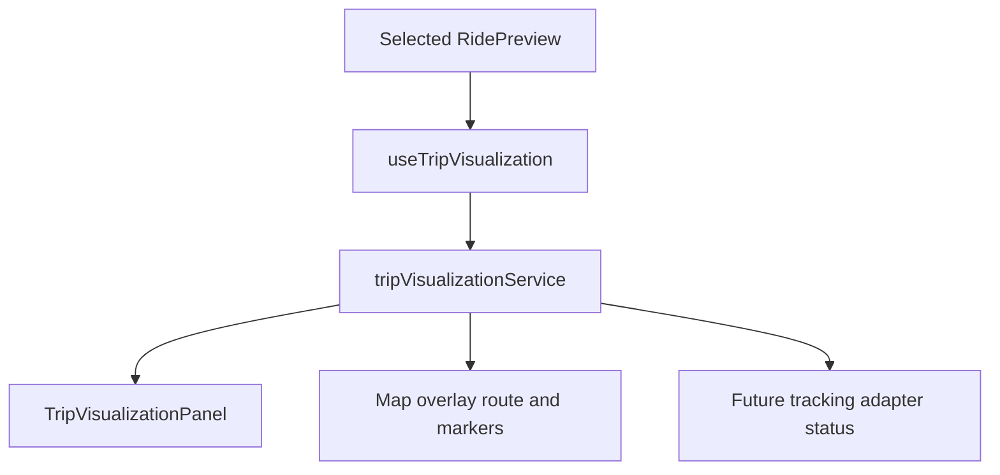
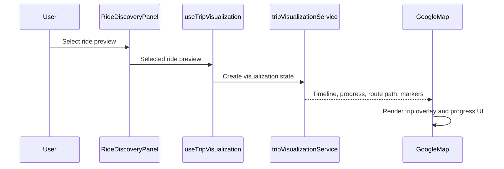

# Google Maps Phase 7

## Overview

Phase 7 adds trip visualization for a selected ride preview. It displays a simulated route overlay, pickup and destination overlay markers, trip progress, a timeline, and a future tracking adapter status.

## Architecture



## Request Flow



## Folder Structure

```text
source/components/google-maps/TripVisualizationPanel.tsx
source/hooks/google-maps/useTripVisualization.ts
source/services/google-maps/tripVisualizationService.ts
source/types/google-maps/tripVisualization.ts
```

## Testing

- Run `npm run build`.
- Run `npx tsc -b --pretty false`.
- Verify selecting a ride preview shows the timeline.
- Verify selected ride overlay appears on the map.
- Verify pickup and destination overlay markers render.
- Verify no live tracking requests are made.

## Troubleshooting

| Issue | Likely Cause | Resolution |
| --- | --- | --- |
| Timeline is hidden | No ride preview is selected | Select a ride from Nearby Rides |
| Progress does not move | Progress is simulated for this phase | Live tracking is reserved for backend integration |
| Overlay is a straight line | Curated demo rides use lightweight frontend route previews | Use a calculated session draft for a richer path |

## Validation

- [x] Trip visualization contracts are strongly typed.
- [x] Timeline and progress UI render from selected ride preview.
- [x] Map overlay is isolated from route calculation.
- [x] Future tracking adapter status is modeled without live tracking.

## Future Roadmap

- Connect live trip tracking to a backend adapter.
- Replace demo progress with vehicle telemetry.
- Add route step details when backend navigation is available.

## Merge Readiness

- Changes remain inside the Google Maps application and `docs/google-maps`.
- No dependency or global configuration changes are required.
- Future merge risk remains isolated to the Google Maps feature module.
