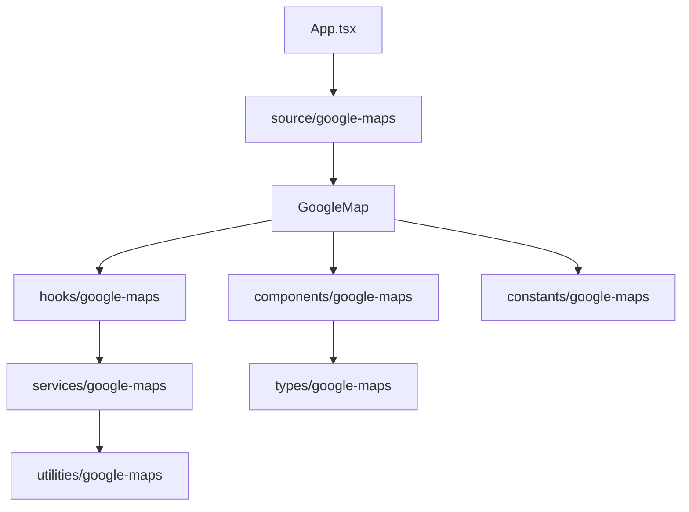
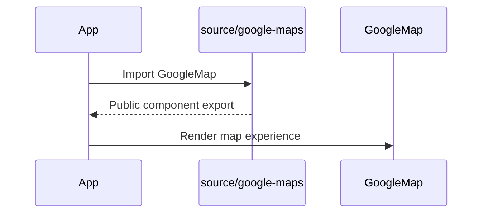

# Google Maps Phase 8

## Overview

Phase 8 refactors the Google Maps application into clearer reusable boundaries. The app now exposes a public Google Maps entry point, separates display constants, and moves route display formatting into pure utilities.

## Architecture



## Request Flow



## Folder Structure

```text
source/google-maps/index.ts
source/constants/google-maps/mapDisplayConfiguration.ts
source/utilities/google-maps/routeFormatting.ts
applications/google_maps_carpooling_platform/MODULE.md
```

## Testing

- Run `npm run build`.
- Run `npx tsc -b --pretty false`.
- Verify the app entry point imports through the public interface.
- Verify route formatting still appears in trip cards and discovery cards.
- Verify map display options still render correctly.

## Troubleshooting

| Issue | Likely Cause | Resolution |
| --- | --- | --- |
| App import fails | Public interface export is missing | Export `GoogleMap` from `source/google-maps/index.ts` |
| Map options fail typecheck | Constants do not match Google Maps types | Keep map constants typed at the boundary |
| Formatting changes unexpectedly | Utility was changed | Run focused formatting tests in Phase 9 |

## Validation

- [x] Public Google Maps exports exist.
- [x] Constants are isolated from the map shell.
- [x] Route formatting is reusable.
- [x] Module documentation reflects new boundaries.

## Future Roadmap

- Add package-level exports when the Google Maps module is merged into the main product.
- Keep future backend adapters behind service boundaries.
- Promote shared contracts only when another application genuinely consumes them.

## Merge Readiness

- Changes remain inside the Google Maps application and `docs/google-maps`.
- No dependency or global configuration changes are required.
- Future merge risk is reduced by making the app entry point depend on a stable public interface.
