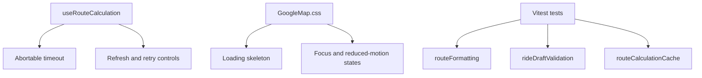
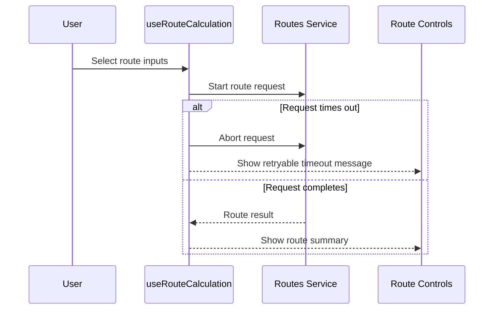

# Google Maps Phase 9

## Overview

Phase 9 hardens the Google Maps module with timeout handling, retry affordances, loading skeletons, accessibility focus states, reduced-motion support, and focused tests for core frontend rules.

## Architecture



## Request Flow



## Folder Structure

```text
source/hooks/google-maps/useRouteCalculation.ts
source/components/google-maps/GoogleMap.css
source/services/google-maps/*.test.ts
source/utilities/google-maps/*.test.ts
package.json
package-lock.json
```

## Testing

- Run `npm run build`.
- Run `npm run typecheck`.
- Run `npm test`.
- Verify timeout errors are retryable.
- Verify keyboard focus is visible on route, ride, and discovery controls.
- Verify reduced-motion users do not receive loading animation.

## Troubleshooting

| Issue | Likely Cause | Resolution |
| --- | --- | --- |
| Tests fail to start | Local dependencies are missing | Run `npm install` inside the Google Maps app |
| Route timeout appears | Network or Routes API latency exceeded the frontend timeout | Use Retry or verify API availability |
| Animation still visible | Browser does not expose reduced-motion preference | Confirm OS and browser accessibility setting |

## Validation

- [x] Route requests have timeout cleanup.
- [x] Retry remains available after route failures.
- [x] Loading skeleton and reduced-motion states are present.
- [x] Focus-visible states are defined for controls.
- [x] Focused tests cover formatting, ride validation, and route cache behavior.

## Future Roadmap

- Add browser-driven accessibility checks before final merge.
- Add integration tests around Places and Routes mocks.
- Add production observability once backend route calls exist.

## Merge Readiness

- Dependency changes are scoped to the Google Maps app.
- No root configuration was modified.
- Future merge risk is limited to app-local package files and Google Maps source files.
