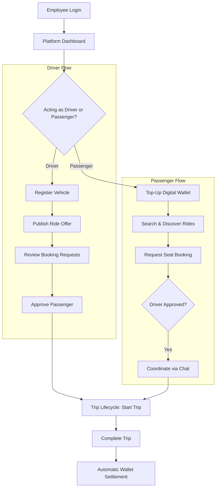
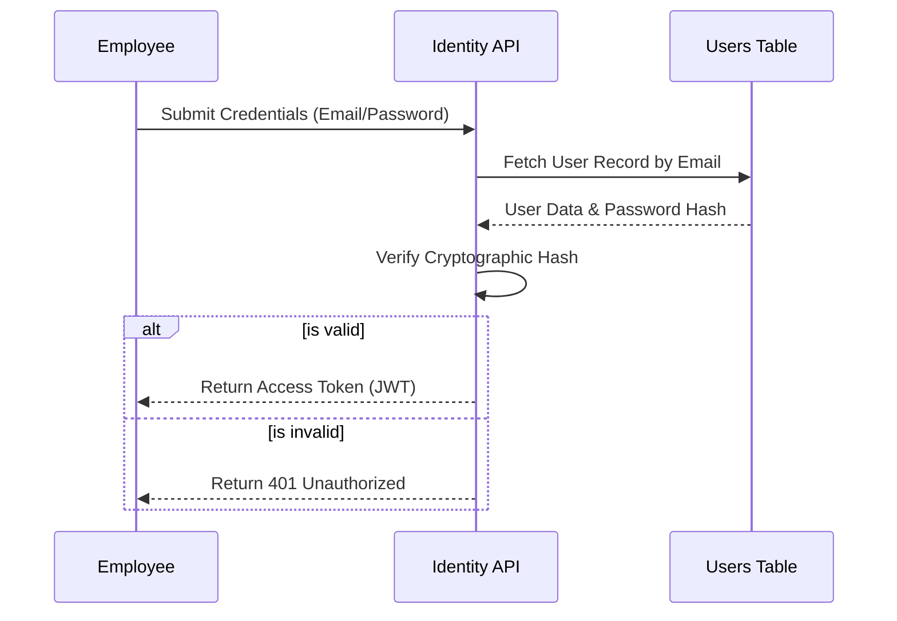
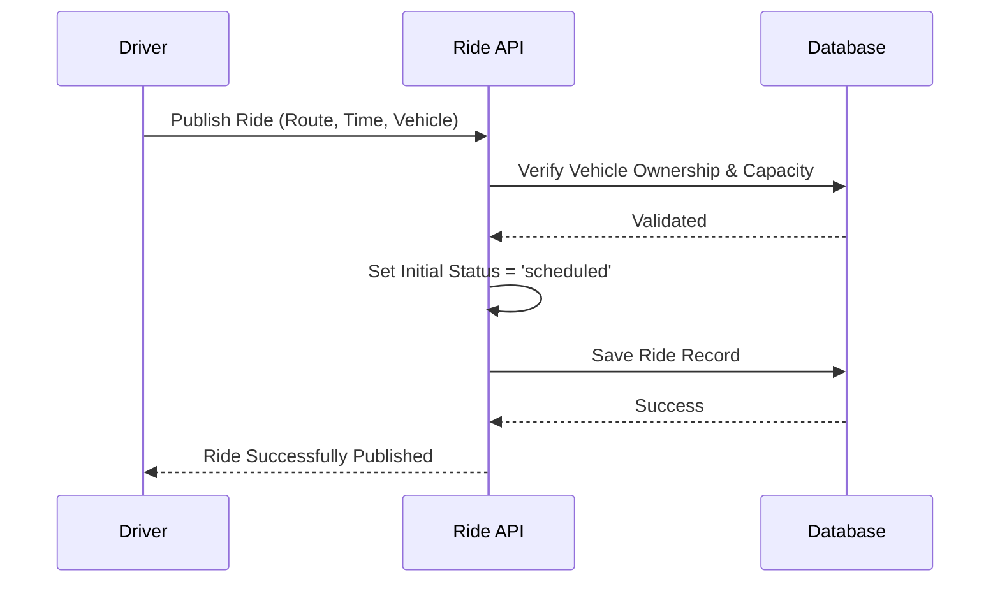
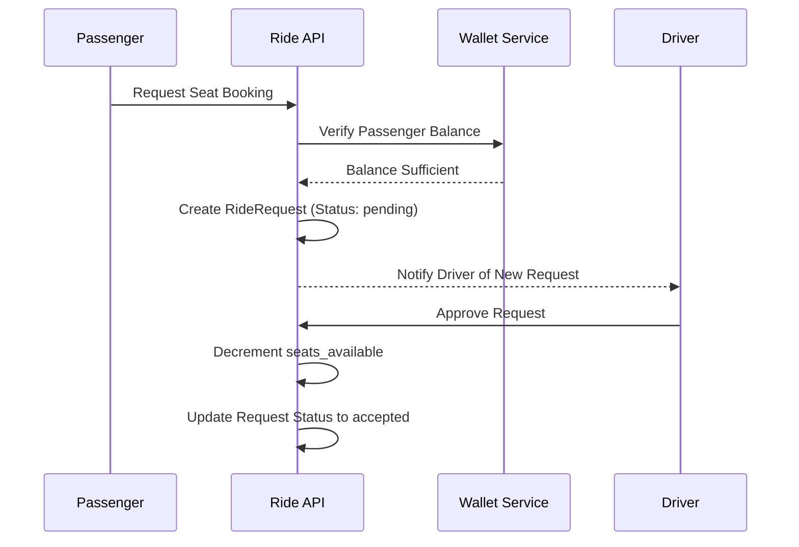
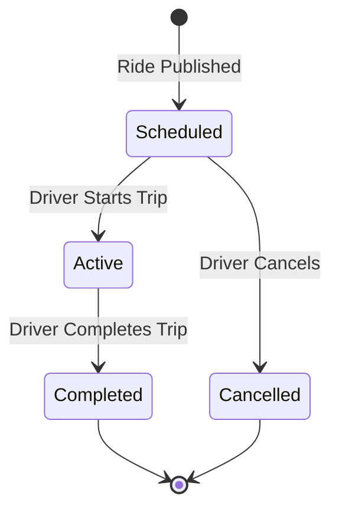
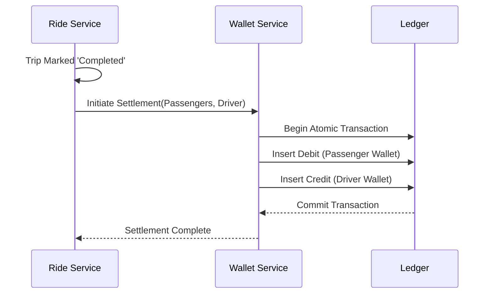
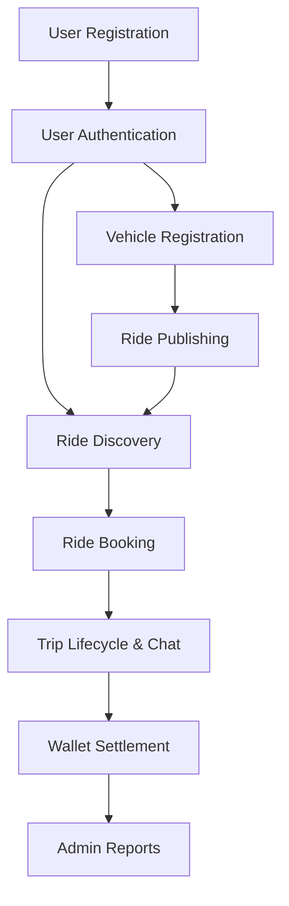

# Business Workflow

## Business Overview

The core objective of the Raahi platform is to eliminate the friction, excessive cost, and environmental impact associated with daily corporate commuting. By creating a closed, trusted network strictly within an organization, the platform allows employees to seamlessly discover, coordinate, and share rides with their verified colleagues.

- **Target Users**: Corporate employees commuting to and from physical office locations.
- **User Roles**: 
  - *Employees*: Act fluidly as both Drivers (Publishing rides) and Passengers (Seeking rides).
  - *Organization Administrators*: Oversee corporate platform adoption, manage the employee roster, and monitor environmental impact.
- **High-level Workflow**: An employee registers their vehicle and publishes their daily commute route. Another employee searches for a ride matching their own commute parameters. The system mathematically evaluates viable routes, handles the booking request workflow, facilitates real-time chat for exact pickup logistics, and automatically settles the cost-sharing via a digital wallet immediately upon trip completion.
- **System Boundaries**: The system operates exclusively within the bounds of a verified organizational email domain. It interfaces with external systems only for complex geospatial mapping logic (Google Maps) and fiat currency onboarding (Payment Gateway).

---

# Business Process Overview

---

# User Roles

### Employee
- **Purpose**: The primary actor participating in the carpool ecosystem.
- **Permissions**: Can act fluidly as a driver, passenger, or both. Fully manages their personal profile, registered vehicles, and digital wallet.
- **Responsibilities**: Ensuring accurate ride publishing, prompt communication via chat, arriving on time, and maintaining sufficient wallet balance.
- **Restrictions**: Restricted from accessing administrative dashboards. Can solely view, chat, and ride with employees verified under their exact same Organization.
- **Modules Used**: Identity, Ride Coordination, Vehicle Management, Wallet, Journey Chat.

### Administrator
- **Purpose**: Oversees the platform's utilization at an organizational level.
- **Permissions**: Can view global corporate statistics, manage employee account statuses, and configure top-level organization settings.
- **Responsibilities**: Verifying offline employees, suspending bad actors or terminated employees, and analyzing platform ROI (carbon offset reporting).
- **Restrictions**: Cannot publish or book rides on behalf of employees using the admin console.
- **Modules Used**: Platform Administration, Dashboard Statistics, Organization Management.

---

# Workflow 1 — User Authentication

**Purpose**: Securely verifies the identity of an employee attempting to access the platform.
**Actors**: Employee.
**Preconditions**: The employee must be registered and verified against a valid corporate domain.
**Modules Involved**: Identity (`employee_self_service`).
**APIs Called**: `POST /api/v1/auth/login` (or equivalent SSO endpoint).
**Database Tables Used**: `Users`
**Business Validations**: The provided password hash must cryptographically match the database; the account must be marked as active and verified.
**Possible Failure Scenarios**: Incorrect credentials, unverified email address, or a suspended account status.

---

# Workflow 2 — User Registration

**Purpose**: Onboards a new employee into the trusted carpool network.
**Preconditions**: The user must possess a valid corporate email address associated with an actively registered Organization on the platform.
**Workflow**:
1. User provides email, secure password, and basic profile info.
2. System extracts the email domain (e.g., `@acme.com`).
3. System verifies the domain exists actively in the `Organizations` table.
4. System creates the `User` record, assigns the `employee` role, and automatically provisions an empty `Wallet` entity for future transactions.
**Business Rules**: The email must be globally unique; the Domain must be registered to an active corporate tenant.

---

# Workflow 3 — Vehicle Registration

**Purpose**: Allows an employee to register a physical vehicle they intend to use for publishing rides.
**Actors**: Employee (acting as Driver).
**Workflow**: 
1. Employee submits vehicle make, model, license plate, and physical seat capacity.
2. System creates a `Vehicle` record tied immutably to the Employee's `user_id`.
**Business Rules**:
- Seat capacity must be strictly greater than zero.
- License plates must be unique across the platform to prevent fraudulent vehicle sharing or spoofing.
**Dependencies**: This workflow must be completed before an employee can execute *Workflow 4 (Ride Publishing)*.

---

# Workflow 4 — Ride Publishing

**Purpose**: Enables a driver to offer empty seats on their upcoming commute.
**Inputs**: Vehicle ID, Origin coordinates, Destination coordinates, Departure Time, Price per Seat.
**Modules Involved**: Ride Coordination, Vehicle Management.
**Workflow**:
1. Driver selects one of their registered vehicles.
2. Driver sets the route and scheduled departure time.
3. System validates the vehicle belongs exclusively to the driver.
4. System creates a `Ride` record with the status `scheduled`.
**Business Validations**: A driver cannot schedule temporally overlapping rides for the same time window. The offered seats cannot exceed the vehicle's physical maximum capacity.

---

# Workflow 5 — Ride Discovery

**Purpose**: Connects passengers with relevant, geographically logical carpool offers without exposing them to massive detours.
**Modules Involved**: Ride Coordination (`ride_discovery`).
**Search Filters**: Passengers search by desired Pickup Location, Drop-off Location, and Time window.
**Matching Process**: 
- The system queries `scheduled` rides within the requested time window.
- It leverages the external Google Maps Distance Matrix API internally to calculate the precise detour time required for the driver to pick up and drop off the passenger.
- Rides are filtered out if the detour exceeds acceptable organizational thresholds.
**Business Validations**: Only rides with `seats_available > 0` are returned. Crucially, only rides published by members of the passenger's specific Organization are visible.

---

# Workflow 6 — Ride Booking

**Purpose**: Facilitates the digital agreement between a passenger and a driver to share a ride.
**Booking Lifecycle**: Passenger Requests -> Driver Approves -> Seats Decremented.
**Modules Involved**: Ride Coordination, Wallet.
**Business Validations**:
- *Seat Availability*: The ride must have at least 1 seat remaining.
- *Financial Solvency*: The passenger's wallet must have a current balance $\ge$ the `price_per_seat`.
- *Duplicate Prevention*: A passenger cannot request the exact same ride twice.
- *Conflict of Interest*: A driver cannot book a seat on a ride they published.

---

# Workflow 7 — Trip Lifecycle

**Purpose**: Manages the physical execution and state machine of the carpool journey.
**Actors**: Driver.

**Implementation Details**:
- `Scheduled`: The ride is open for passenger discovery and bookings.
- `Active`: Passengers are picked up; the booking roster is locked.
- `Completed`: The journey is finished. This state transition acts as the trigger for asynchronous financial settlement.

---

# Workflow 8 — Live Trip Tracking (Coordination)

**Purpose**: Allows passengers and drivers to coordinate pickup logistics smoothly in real-time.
**Workflow**: 
- Upon ride approval, passengers and the driver are granted secure access to a ride-specific WebSocket channel via the `Journey Chat` module.
- **Real-time communication**: Parties exchange messages regarding exact pickup spots or slight traffic delays.
- **Connection lifecycle**: The chat channel is exclusively active while the ride status is `scheduled` or `active`.
- **Note**: Continuous GPS live-tracking streaming is not natively implemented; micro-coordination relies on this real-time textual context.

---

# Workflow 9 — Payments & Wallet

**Purpose**: Ensures frictionless, completely cashless cost-sharing between colleagues.
**Modules Involved**: Wallet, Payment Processing.
**Workflow (Top-Up)**:
1. Employee initiates a top-up via a third-party payment gateway integration.
2. The Gateway fires a cryptographically secured webhook back to the platform.
3. The system validates the signature, records a `credit` in the `Wallet_Transactions` ledger, and increments the user's available balance.
**Workflow (Settlement)**:
1. Driver marks the trip as `Completed`.
2. System identifies all `accepted` passengers on the roster.
3. System executes an atomic database transaction creating a `debit` ledger entry for the passenger and a corresponding `credit` ledger entry for the driver.
**Business Rules**: Ledger transactions are strictly atomic; funds are never created or destroyed globally, only transferred securely between wallets.

---

# Workflow 10 — Reports & Analytics

**Purpose**: Provides organizations with actionable, high-level metrics regarding their corporate sustainability and platform adoption.
**Data Sources**: Aggregated exclusively from `Rides`, `Users`, and `Wallet_Transactions`.
**Business Metrics Generated**:
- Total active carpoolers per organization.
- Total aggregate kilometers saved.
- Estimated Carbon (CO2) emissions offset.
- Total financial savings retained by employees.

---

# Workflow 11 — Administration

**Purpose**: Allows corporate IT or HR administrators to govern the platform safely and ensure compliance.
**Existing Workflows**:
- **Employee Management**: Viewing the employee roster, manually verifying users who missed or failed automated email verification flows, or suspending users who have been terminated from the company.
- **Configuration**: Updating the allowed corporate email domains associated with their Organization entity to ensure only valid hires can register.

---

# Business Rules

| Business Rule | Purpose | Where Enforced |
| :--- | :--- | :--- |
| **Organization Isolation** | Security & Privacy; strictly prevents cross-company data leakage or unauthorized ride sharing. | Database Joins & Identity Service |
| **Driver Ownership** | Fraud prevention; a driver can only publish rides using physical vehicles they registered. | Ride Coordination Service |
| **Seat Capacity Limit** | Safety and logistics; prevents a car from being mathematically overbooked. | Database Check Constraint & Service |
| **No Self-Booking** | Logic integrity; a driver cannot occupy a passenger seat in their own car. | Ride Booking Service |
| **Strict Positive Ledger** | Financial integrity; a wallet balance can never fall below zero. | Database Check Constraint |
| **Post-Trip Settlement**| Trust; passengers are only financially charged after the trip is successfully completed. | Trip Lifecycle Service |

---

# Exception Handling

- **No Rides Available**: The system returns an empty list gracefully. The PWA UI prompts the user to check back later or widen their acceptable time window.
- **Duplicate Booking**: If a passenger attempts to request the same ride twice, the Service layer traps the action and returns a `400 Bad Request` indicating "Already requested."
- **Ride Full**: If a driver attempts to approve a passenger but `seats_available` is 0 due to a concurrent race condition, the database constraint fails safely, the transaction rolls back, and a `400 Bad Request` is surfaced to the driver.
- **Payment Webhook Failure**: If an incoming top-up webhook signature is invalid, the request is dropped immediately (`400 Bad Request`), and the top-up is ignored to prevent financial injection attacks.

---

# Workflow Dependency Map

---

# Design Decisions

| Decision | Reason | Advantages | Trade-offs |
| :--- | :--- | :--- | :--- |
| **Post-Trip Settlement** | Passengers should not lose funds or require refunds if a driver cancels last minute. | Builds immense user trust in the platform. | Requires passengers to maintain sufficient balance beforehand, and requires complex logic to conceptually "hold" funds. |
| **Organizational Silos** | Corporate carpooling relies heavily on implicit trust between verified colleagues. | Exceptionally high safety perception; zero interactions with strangers. | Severely limits global ride liquidity (matches) compared to public ride-sharing applications. |
| **Wallet-First Economics** | Prevents dealing with exorbitant credit card processing fees for every $2 micro-transaction. | Extremely low transaction friction; instant settlement. | Requires passengers to pre-load funds, creating slight onboarding friction. |

---

# Future Workflow Enhancements

- **Recurring Rides**: Allow drivers to publish a template (e.g., "Every Monday-Friday at 8 AM") to reduce the daily friction of manual ride publishing.
- **Corporate Subsidies (Reward System)**: Organizations could inject funds directly into employee wallets via API as a green-initiative reward for consistently carpooling.
- **Dynamic Routing**: Instead of fixed point-to-point routes, the system could suggest slight intelligent diversions to drivers actively en route to pick up passengers seamlessly.
- **Ride Cancellation Penalties**: Deduct a small automated wallet fee from users who cancel confirmed bookings within 1 hour of departure to actively discourage flakiness.
