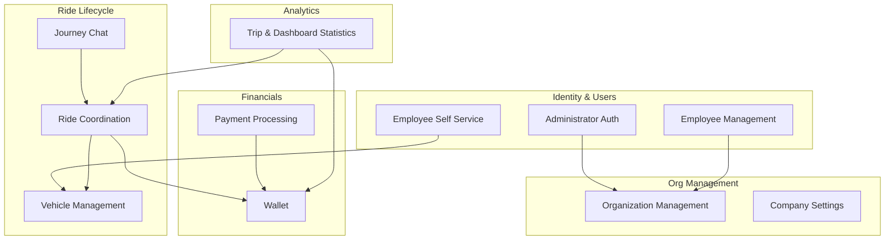
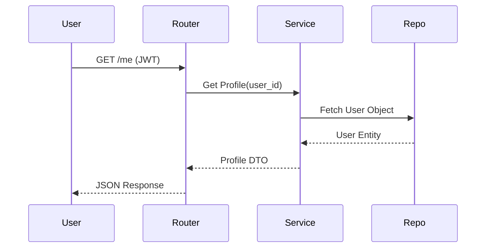
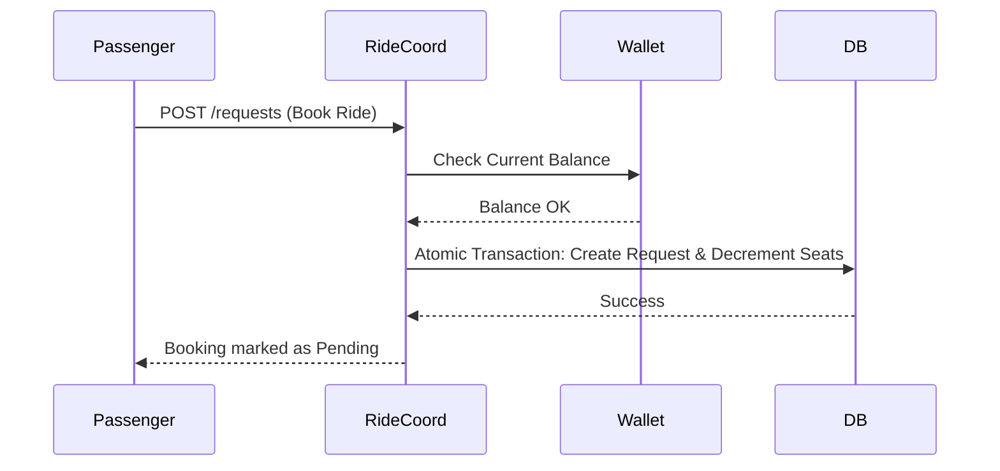
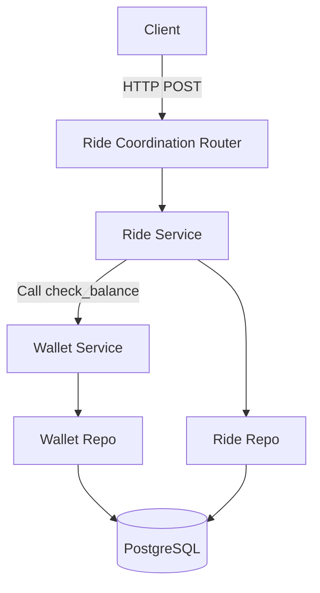

# Module Overview

The Raahi backend is explicitly architected around a **Modular Monolith** paradigm, heavily inspired by Domain-Driven Design (DDD). 

- **Why the application is modular**: By isolating business logic into distinct, highly cohesive feature modules rather than technical layers (e.g., grouping all controllers together), the platform completely avoids the tangled dependencies typical of traditional monolithic architectures.
- **Benefits of current separation**: This strict separation ensures that a structural change in the `Wallet` module does not inadvertently break the `Ride Coordination` logic. It enables developers to work safely within bounded contexts, drastically reduces merge conflicts, and prepares the system for seamless extraction into microservices as scaling demands dictate.
- **High-level module organization**: All core business domains reside under `applications/backend_application/source/modules/`. Modules communicate via explicitly defined internal service methods and are strictly forbidden from executing raw SQL against tables owned by other modules.

---

# Module Architecture



---

# Complete Module Inventory

| Module Name | Purpose | Main Responsibility | Depends On | Used By |
| :--- | :--- | :--- | :--- | :--- |
| **Employee Self Service** | Identity & Profiles | Managing personal employee profile data securely. | Shared Auth | Ride Coordination |
| **Vehicle Management** | Vehicle Registry | Storing and verifying vehicle capacities and plates. | Employee Self Service | Ride Coordination |
| **Ride Coordination** | Core Carpooling | Publishing, matching, booking, and trip execution. | Vehicles, Wallet | Journey Chat, Stats |
| **Wallet** | Digital Ledger | Tracking balances and executing internal transfers safely. | None | Payments, Rides |
| **Payment Processing** | Fiat Gateway | Bridging external webhooks to the digital wallet. | Wallet | None |
| **Journey Chat** | Real-time Comms | Facilitating ride-specific WebSocket messaging. | Ride Coordination | None |
| **Organization Mgmt** | Multi-tenancy | Managing corporate entities and domains. | None | Employee Management |
| **Dashboard Statistics**| Analytics | Aggregating platform metrics for administrative views. | Rides, Wallets, Orgs | None |

---

# Individual Module Documentation

## Employee Self Service

### Purpose
Empowers corporate employees to manage their own identities, profiles, and authentication credentials without requiring administrative intervention.

### Responsibilities
- Securely fetching and updating user profiles.
- Validating corporate email domains during self-registration.

### Main Features
- Profile retrieval and updating.
- Account self-registration.

### Folder Structure
```text
modules/employee_self_service/
├── employee_self_service_http_routes.py
├── employee_self_service.py
└── schemas.py
```

### Database Entities
- `Users`

### APIs
- References: `GET /api/v1/employees/me`, `PUT /api/v1/employees/me` (See API Design Documentation).

### Dependencies
- **Internal**: Relies on `shared_infrastructure` for JWT generation and validation.
- **External**: None.

### Business Rules
- Employees must register using an email domain strictly matching an active registered Organization.
- Profiles can only be accessed by the authenticated owner.

### Request Flow


### Error Handling
- **Validation**: Rejects malformed profile updates instantly via Pydantic.
- **Exceptions**: Throws a `404 Not Found` mapping if the user record is suspended or physically missing.

### Future Improvements
- Integrate OAuth2/OIDC for Single Sign-On (SSO) directly with corporate Google Workspace or Microsoft Entra ID.

---

## Vehicle Management

### Purpose
To maintain a verified, distinct registry of vehicles utilized for corporate carpooling.

### Responsibilities
- Validating license plate formats.
- Enforcing positive seat capacity limits.
- Storing vehicle metadata.

### Main Features
- Vehicle Registration.
- Vehicle Listing per employee.

### Folder Structure
```text
modules/vehicle_management/
├── vehicle_management_http_routes.py
├── vehicle_service.py
└── vehicle_repository.py
```

### Database Entities
- `Vehicles`

### APIs
- References: `/api/v1/vehicles` (See API Design Documentation).

### Dependencies
- **Internal**: `Employee Self Service` (to ensure the user implicitly exists).

### Business Rules
- A vehicle must have a capacity strictly greater than 0.
- License plates must be unique globally across the entire platform.

### Error Handling
- Throws a custom domain exception mapped to `409 Conflict` if a license plate is already registered by another user.

### Security
- Scoped authorization dictates that users can only query and mutate vehicles tied to their own `user_id`.

### Future Improvements
- Integration with external DMV or insurance verification APIs for strict corporate compliance.

---

## Ride Coordination

### Purpose
The core logistical engine of the Raahi platform, responsible for orchestrating the entire lifecycle of a carpool journey.

### Responsibilities
- Ride publishing and geospatial validation.
- Ride request (booking) state machines.
- Trip lifecycle (Start, Complete, Cancel).
- Financial holding logic during active bookings.

### Main Features
- Intelligent Ride Discovery.
- Seat booking and driver approvals.
- Real-time trip status transitions.

### Folder Structure
```text
modules/ride_coordination/
├── ride_discovery_http_routes.py
├── ride_trip_http_routes.py
├── ride_booking_service.py
└── ride_coordination_repository.py
```

### Database Entities
- `Rides`
- `Ride_Requests`

### APIs
- References: `/api/v1/rides`, `/api/v1/trips` (See API Design Documentation).

### Dependencies
- **Internal**: `Vehicle Management`, `Wallet`.
- **External**: Google Maps Platform (for highly accurate detour and ETA calculations).

### Business Rules
- A driver fundamentally cannot book a seat on their own ride.
- Global seat availability can never drop below zero.
- Passengers must possess sufficient digital wallet balance to even request a ride.

### Request Flow


### Error Handling
- Extensive handling for race conditions (e.g., throwing `SeatUnavailableError` which maps to `400 Bad Request` if two users book the final seat simultaneously).

### Security
- Status transitions are scoped strictly; only the Ride's creator can transition the trip to `active` or `completed`.

### Future Improvements
- Algorithmic matching optimization utilizing dedicated spatial graph algorithms (PostGIS routing) to reduce reliance on external Maps APIs for initial broad filtering.

---

## Wallet

### Purpose
Provides a secure, completely isolated digital ledger for seamless intra-platform payments.

### Responsibilities
- Tracking user balances precisely.
- Recording immutable credit/debit transactions.
- Facilitating internal atomic funds transfers.

### Main Features
- Balance checking.
- Paginated transaction history.
- Internal atomic transfers.

### Folder Structure
```text
modules/wallet/
├── wallet_http_routes.py
├── wallet_service.py
└── wallet_repository.py
```

### Database Entities
- `Wallets`
- `Wallet_Transactions`

### Dependencies
- **Internal**: None. Operates completely independently.

### Business Rules
- Wallet balances strictly cannot fall below 0 under any circumstance.
- All ledger transactions must be strictly typed as `credit` or `debit`.

### Request Flow
- Financial mutations are primarily invoked internally by `Ride Coordination` (upon trip completion) and `Payment Processing` (upon top-up), rather than via public HTTP routes directly.

### Error Handling
- Traps database-level `CHECK` constraints to throw an application-level `InsufficientFundsError`.

### Security
- The append-only, immutable ledger design entirely prevents tampering with historical transaction amounts or fabricating funds.

### Future Improvements
- Periodic snapshotting and automated archiving of ledger entries to maintain lightning-fast read performance as transactions grow into the millions.

---

## Payment Processing

### Purpose
To bridge external fiat currencies into the Raahi digital wallet ecosystem securely.

### Responsibilities
- Initializing secure payment gateway sessions.
- Validating and reconciling asynchronous webhooks.
- Orchestrating wallet deposits.

### Main Features
- Wallet top-ups.
- Webhook signature reconciliation.

### Folder Structure
```text
modules/payment_processing/
├── payment_processing_http_routes.py
└── payment_service.py
```

### Dependencies
- **Internal**: `Wallet`.
- **External**: Third-party Payment Gateway Provider.

### Business Rules
- Payment webhooks must be cryptographically verified using the provider's payload signature before crediting the internal wallet to prevent fraudulent injections.

### Error Handling
- If webhook signature validation fails, a `400 Bad Request` is returned immediately, no funds are transferred, and the event is logged as a potential security incident.

### Future Improvements
- Dedicated microservice extraction to handle immense webhook traffic gracefully during peak corporate commuting hours.

---

## Journey Chat

### Purpose
To provide isolated, real-time communication contexts specifically for active carpool participants to coordinate pickups.

### Responsibilities
- Accepting WebSocket connections.
- Broadcasting payload messages to connected peers.
- Persisting chat history synchronously.

### Main Features
- Real-time ride messaging.

### Folder Structure
```text
modules/journey_chat/
├── journey_chat_http_routes.py
└── chat_manager.py
```

### Database Entities
- `Journey_Messages`

### Dependencies
- **Internal**: `Ride Coordination` (to verify the connecting user actually belongs to the ride).

### Business Rules
- Users can only successfully negotiate a WebSocket connection if they are the Driver or an *Approved* Passenger for the specific `ride_id`.

### Error Handling
- Forcefully closes WebSocket connections with a `1008 Policy Violation` close code if authorization fails mid-stream.

### Future Improvements
- Integration with Redis Pub/Sub to allow WebSocket broadcasting across multiple horizontally scaled backend Uvicorn instances.

---

## Organization Management

### Purpose
Facilitates multi-tenancy by managing the lifecycle, constraints, and limitations of corporate entities.

### Folder Structure
```text
modules/organization_management/
├── organization_management_http_routes.py
└── organization_service.py
```

### Database Entities
- `Organizations`

### Dependencies
- **Internal**: None.

### Business Rules
- Email domains must be globally unique to prevent employees from inadvertently registering under the wrong corporate umbrella.

---

# Module Communication

The backend enforces strict separation of concerns. Modules communicate via synchronous Python method calls across boundaries. A router in Module A invokes a service in Module A, which can then safely inject and invoke a service in Module B.



---

# Cross-Cutting Components

Located under `shared_infrastructure/`, these components are absolutely crucial but do not belong to a specific business domain. They serve all modules universally:

- **Database Pool**: Initializes the `asyncpg` engine and provides the SQLAlchemy `AsyncSession` dependency for all repositories.
- **Authentication Dependency**: Contains the global `verify_jwt` logic utilized by nearly every single router.
- **Exceptions**: Defines the global API Exception hierarchy (e.g., `BaseAPIError`), ensuring error codes and JSON structures remain perfectly uniform across wildly different modules.
- **Configuration**: Handles parsing the `.env` file via Pydantic `BaseSettings`, injecting credentials safely.

---

# Module Dependency Matrix

| Module | Employee SS | Vehicle Mgmt | Ride Coord | Wallet | Payment Proc | Journey Chat | Org Mgmt |
| :--- | :---: | :---: | :---: | :---: | :---: | :---: | :---: |
| **Employee SS**| - | | | | | | x |
| **Vehicle Mgmt** | x | - | | | | | |
| **Ride Coord** | x | x | - | x | | | |
| **Wallet** | x | | | - | | | |
| **Payment Proc** | | | | x | - | | |
| **Journey Chat** | x | | x | | | - | |
| **Org Mgmt** | | | | | | | - |

*(Note: "x" indicates the row module logically depends on the column module).*

---

# Design Decisions

| Decision | Reason | Advantages | Trade-offs |
| :--- | :--- | :--- | :--- |
| **Domain-Driven Folders** | Grouping by feature (e.g., `wallet`) rather than technical layer (e.g., `controllers`, `models`). | Extremely high cohesion; understanding a feature requires looking in only one directory. | Can lead to duplicated cross-cutting logic if not rigorously pushed to `shared_infrastructure`. |
| **Service-to-Service Communication** | Modules invoke other module *Services* instead of executing SQL queries against external tables. | Strictly prevents database coupling; changes to Wallet SQL do not break Ride logic. | Execution remains internal and synchronous; no native fault tolerance if a service call fails mid-transaction. |

---

# Scalability

- **Maintainability**: The bounded contexts strictly prevent spaghetti code, allowing a developer to refactor the `Payment Processing` module with absolute confidence that `Journey Chat` will not break.
- **Extensibility**: Adding a massive new feature (like "Loyalty Points") simply requires creating a new folder under `modules/` and connecting its service to the Ride Coordination lifecycle.
- **Future Microservices**: Because modules currently communicate strictly via service interfaces and never cross database entity boundaries, extracting a module into a standalone containerized microservice requires minimal refactoring.
- **Limitations**: The current synchronous service-to-service communication implies that if the Wallet transaction is exceptionally slow, the entire HTTP request for Ride Booking will block and timeout. 

---

# Future Improvements

- **Event-Driven Pub/Sub**: Replace synchronous internal service calls with an in-memory asynchronous event bus (e.g., using `blinker` or `PyPubSub`). For example, `RideService` emits a `RideCompletedEvent`, which `WalletService` listens to autonomously, entirely decoupling the HTTP execution flow.
- **Strict DTO Contracts**: Enforce that modules only exchange Pydantic models (DTOs) during internal service-to-service calls, rather than passing raw SQLAlchemy models. This will prevent accidental and highly inefficient lazy-loading I/O across module boundaries.
