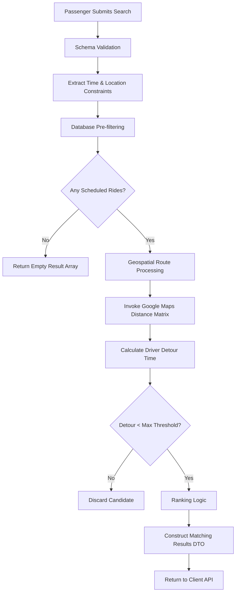
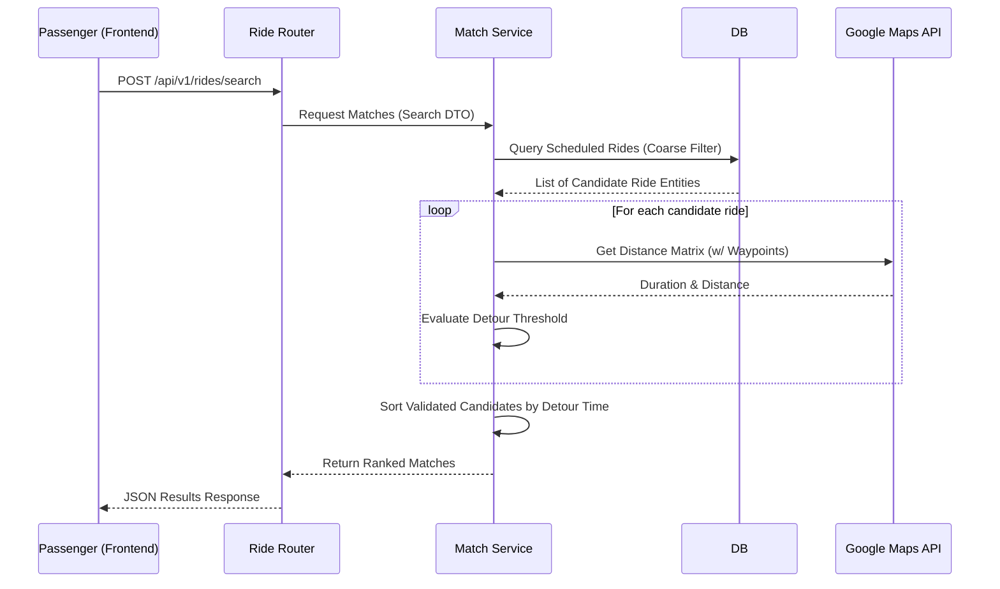

# Ride Matching Engine

## Executive Summary

The Ride Matching Engine acts as the central logistical brain of the Raahi platform. Its primary purpose is to seamlessly, safely, and efficiently connect corporate colleagues who share similar physical commute routes, without imposing unacceptable detours or delays on the driver.

Because Raahi is a closed-network corporate carpool system, the ride matching algorithm is the heartbeat of the application. It directly drives the platform's liquidity (the likelihood a passenger successfully finds a ride) while actively minimizing friction for drivers. The engine evaluates temporal, spatial, and organizational constraints simultaneously to surface only highly relevant, safe, and geometrically viable ride options.

---

# Matching Workflow



---

# Matching Inputs

| Input Parameter | Type | Required | Description |
| :--- | :--- | :---: | :--- |
| **Pickup Location** | String/Coords | Yes | The exact address or latitude/longitude the passenger requests to be picked up from. |
| **Drop-off Location** | String/Coords | Yes | The final destination address or coordinates (often the corporate office). |
| **Travel Date** | Date | Yes | The specific calendar day the commute takes place. |
| **Time Window** | Time Range | No | Acceptable departure/arrival bounding box (e.g., +/- 30 mins). |
| **Organization ID** | UUID | Implicit | Automatically injected from the caller's verified JWT to securely isolate database queries. |

*(Note: Advanced parameters like Vehicle Type, Driver Rating, or Recurring Ride toggles are not currently active search filters in the baseline implementation).*

---

# Matching Criteria

### Organizational Isolation
- **Purpose**: Restrict ride visibility strictly to verified colleagues.
- **Importance**: Critical.
- **Business Reasoning**: Raahi's fundamental value proposition is a *trusted* network. Mixing corporate domains breaks the security model entirely.
- **Affect on Matching**: Acts as an absolute, non-negotiable hard filter at the database level.

### Temporal Alignment
- **Purpose**: Ensure the driver's departure aligns logically with the passenger's request.
- **Importance**: High.
- **Business Reasoning**: Commuters adhere to rigid work schedules; suggesting a ride 4 hours early is useless and degrades trust in the search engine.
- **Affect on Matching**: Filters database queries using strict `start_time >=` and `<=` constraints.

### Seat Availability
- **Purpose**: Prevent physical overbooking.
- **Importance**: Critical.
- **Business Reasoning**: A vehicle physically cannot hold more passengers than it has seatbelts.
- **Affect on Matching**: Hard filter `WHERE seats_available > 0`.

### Detour Threshold (Spatial Viability)
- **Purpose**: Prevent driver friction and annoyance.
- **Importance**: High.
- **Business Reasoning**: A driver will flatly reject a passenger request if picking them up adds 40 minutes to a standard 30-minute commute.
- **Affect on Matching**: Post-database, in-memory filter evaluating Google Maps Distance Matrix mathematical outputs.

---

# Matching Algorithm

The matching algorithm utilizes a standard **hybrid approach**: an initial coarse-grained database filter to drastically reduce the dataset, followed by a fine-grained in-memory spatial evaluation.

### Step-by-step
1. **Input**: Receive passenger constraints (Origin, Destination, Date).
2. **Validation**: Pydantic validates the payload schemas and data types.
3. **Database Pre-filtering (Coarse Filter)**: Query the `Rides` table for all rides where `status = 'scheduled'`, `seats_available > 0`, and the `organization_id` perfectly matches the caller.
4. **Spatial Evaluation (Fine Filter)**: Iterate through the returned candidate rides in Python memory. For each candidate, construct a waypoint route: `Driver Origin -> Passenger Origin -> Passenger Destination -> Driver Destination`.
5. **Maps API Call**: Invoke the Google Maps Distance Matrix to calculate the total estimated duration of this newly constructed route.
6. **Threshold Filtering**: Compare the new waypoint duration to the driver's original direct duration. If `(New_Duration - Old_Duration) > Max_Detour_Threshold`, discard the candidate immediately.
7. **Ranking**: Order the surviving viable candidates.
8. **Output**: Serialize the result list to a JSON array.

### Pseudocode

```python
def find_matching_rides(passenger_request: RideSearchDTO, current_user: User):
    # 1. Coarse Database Filter
    candidates = database.query(Ride).filter(
        Ride.status == 'scheduled',
        Ride.organization_id == current_user.organization_id,
        Ride.seats_available > 0,
        Ride.start_time >= passenger_request.earliest_time,
        Ride.start_time <= passenger_request.latest_time
    ).all()

    if not candidates:
        return []

    valid_matches = []
    
    # 2. Fine-grained Spatial Filter
    for ride in candidates:
        original_duration = maps_service.get_duration(ride.origin, ride.destination)
        
        # Calculate new detour time
        detour_duration = maps_service.get_waypoint_duration(
            start=ride.origin, 
            waypoints=[passenger_request.pickup, passenger_request.dropoff], 
            end=ride.destination
        )
        
        detour_time = detour_duration - original_duration
        
        # Check against business rule threshold (e.g., maximum 15 mins extra driving)
        if detour_time <= MAX_DETOUR_THRESHOLD_MINUTES:
            ride.detour_time = detour_time  # Attach transient property for ranking
            valid_matches.append(ride)
            
    # 3. Ranking
    ranked_matches = sort_by_minimal_detour(valid_matches)
    
    return ranked_matches
```

---

# Search Strategy

- **Database Queries**: SQLAlchemy leverages asynchronous execution (`asyncpg`) to non-blockingly fetch the initial candidate list rapidly.
- **Filtering**: Two-pass filtering. Temporal, Status, and Organization bounds are pushed down directly to the PostgreSQL layer to drastically reduce the dataset payload. Geospatial bounds are filtered in Python memory.
- **Sorting**: Not performed at the database level, because true spatial distance calculation requires the Maps API HTTP response first.
- **Pagination**: Implemented using standard `limit` and `offset` *after* the in-memory array is populated and sorted.
- **Optimization Techniques**: Currently relies on the highly restrictive dataset constraints of a single corporate organization to maintain overall performance.

---

# Route Processing

- **Distance & ETA Calculation**: The platform fundamentally outsources complex routing geometry and real-time traffic ETAs to the Google Maps APIs to guarantee accuracy.
- **Route Validation**: Implicitly handled by the Maps API. If a location string cannot be geocoded into a valid routable coordinate, the search throws a validation exception and drops the candidate.
- **Polyline Handling**: Not explicitly processed or intersected by the backend matching engine; polylines are typically generated client-side on the frontend PWA using origin/destination coordinates returned by the API.

---

# Ranking Logic

The algorithm inherently prioritizes driver convenience to ensure high platform supply liquidity.

1. **Shortest Detour (Primary)**: Rides that require the absolute least amount of extra driving time for the driver are ranked at the top.
2. **Earliest Departure (Secondary)**: If detour times are mathematically identical, rides departing chronologically sooner are surfaced first.

---

# Business Rules

| Business Rule | Purpose | Where Enforced |
| :--- | :--- | :--- |
| **Ride must have available seats** | Prevents physically overbooking the vehicle. | Database Query (`WHERE seats_available > 0`) |
| **Driver cannot book own ride** | Maintains logical and financial integrity. | Service Layer (Post-Search / Booking Phase) |
| **Same Organization Only** | Ensures absolute trust and corporate security bounds. | Database Query (`organization_id = ?`) |
| **Ride must be active** | Passengers cannot book cancelled or already completed rides. | Database Query (`status = 'scheduled'`) |

---

# Database Interaction

- **Tables Queried**: `Rides` (Primary entity), `Vehicles` (Joined strictly to fetch capacity and model data for the UI representation).
- **Relationships**: `Ride` -> `Vehicle` -> `User` (Driver).
- **Indexes Utilized**: 
  - `idx_rides_status_org`: Crucial for lightning-fast pre-filtering.
  - `idx_rides_start_time`: Crucial for range queries on the calendar date.
- **Performance Considerations**: Because the primary query uses highly selective columns (`organization_id`, `status`), the database footprint is extremely small, typically returning `< 50` rows per query before handing off to the Maps API.

---

# API Flow



---

# Performance Analysis

- **Current Algorithm Complexity**: $\mathcal{O}(N)$ where $N$ is the number of currently scheduled rides within the specific organization on the requested day. The major architectural bottleneck is the constant $\mathcal{O}(1)$ external HTTP API call per candidate.
- **Database Efficiency**: High. The initial B-Tree index scan on `(organization_id, status)` is incredibly fast.
- **Search Scalability**: Extremely Poor. Making a synchronous HTTP request to Google Maps for *every single candidate ride* during the user's HTTP request lifecycle will cause massive latency spikes, timeouts, and API rate-limiting if the candidate pool ever exceeds ~20-30 rides.
- **Memory Usage**: Minimal. The in-memory candidate arrays are naturally small due to corporate domain boundaries.

---

# Failure Scenarios

- **No rides found**: The database returns zero candidates initially, or all candidates ultimately fail the detour threshold calculation. The system returns `200 OK` with an empty JSON array `[]` gracefully.
- **Invalid route**: Google Maps returns a `ZERO_RESULTS` geocoding error for obscure addresses. The system traps this gracefully and drops the candidate silently rather than failing the entire request for the user.
- **Maps API failure / Timeout**: If Google Maps is unreachable, the API returns a `502 Bad Gateway` or `500 Internal Server Error`, as accurate matching is physically impossible without the underlying detour math.
- **Ride full**: Evaluated concurrently at the exact time of booking, not during search. (The search endpoint returns a snapshot in time).

---

# Scalability Strategy

To adapt the matching engine for thousands or millions of concurrent rides globally, the architecture must fundamentally shift to avoid external I/O:

1. **Eliminate Synchronous API Calls**: The current $\mathcal{O}(N)$ external HTTP call pattern per search must be completely eradicated.
2. **Geospatial Database Indexing**: Migrate the core database engine to utilize PostGIS. Store origin and destination as `GEOGRAPHY` point columns. Use PostGIS `ST_DWithin` functions to perform radius-based matching directly within the database index (e.g., "Find rides where the driver origin is within a 2km radius of the passenger origin").
3. **Caching**: Utilize Redis to cache active ride coordinates and pre-calculated distances between major corporate office hubs to serve 90% of requests instantly.

---

# Technology Decisions

| Decision | Reason | Advantages | Trade-offs |
| :--- | :--- | :--- | :--- |
| **Hybrid Filter Approach** | Keeps the database schema simple without requiring complex PostGIS extensions immediately during initial development. | Fast time-to-market; utilizes standard PostgreSQL perfectly. | Will not scale past a few dozen concurrent rides per search due to severe N+1 API call latency. |
| **Google Maps Integration** | In-house routing algorithms are immensely complex and often highly inaccurate regarding real-time traffic. | Highly accurate ETAs and detour calculations reflecting real-world road conditions. | Severe vendor lock-in, potential API rate limiting, and linear per-query financial costs. |
| **In-Memory Ranking** | Ranking strictly requires the calculated detour time, which is only available *after* the Maps API response. | Simplifies the initial database query vastly. | Pagination must be done heavily in memory rather than efficiently at the database cursor level. |

---

# Future Enhancements

*The following concepts represent realistic architectural evolutions and are strictly separate from the current baseline implementation.*

- **Geospatial Indexing (PostGIS)**: Move the radius and detour filtering logic directly into the PostgreSQL engine using bounding boxes to eliminate the N+1 API call bottleneck completely.
- **Route Polyline Hashing (Geohashes)**: Convert the driver's anticipated route into a series of Geohashes stored in Redis, allowing the engine to instantly evaluate via string prefix matching if a passenger's pickup location intersects the driver's path.
- **AI-Based Ride Recommendations**: Utilize machine learning to analyze historical commute patterns and proactively suggest rides to passengers via push notifications before they even open the app.
- **Dynamic Detour Thresholds**: Instead of a flat 15-minute threshold, dynamically adjust acceptable detour limits based on the total baseline length of the commute (e.g., 10% of total travel time).
- **Carbon Emission Optimization Ranking**: Re-rank matches slightly based on the vehicle type (e.g., EVs rank higher) to maximize the organization's carbon offset metrics.
